# Zaza — Architecture Document

Zaza is a financial research agent built **on top of Claude Code**. Claude Code provides the agent loop, LLM, context management, multi-turn conversation, and terminal UI. Zaza adds domain-specific financial data tools and technical analysis via an MCP server, with CLAUDE.md providing the behavioral instructions. Complex, multi-tool workflows are delegated to **Claude Code sub-agents** that run in isolated context windows, keeping the main conversation context lean.

---

## Table of Contents

1. [Core Principle](#1-core-principle)
2. [What Claude Code Provides](#2-what-claude-code-provides)
3. [What Zaza Builds](#3-what-zaza-builds)
4. [Project Structure](#4-project-structure)
5. [MCP Server](#5-mcp-server)
6. [Sub-Agent Architecture](#6-sub-agent-architecture)
7. [MCP Tool Catalog](#7-mcp-tool-catalog)
8. [Technical Analysis Sub-Tools](#8-technical-analysis-sub-tools)
9. [Financial Data Sources & Caching](#9-financial-data-sources--caching)
10. [Browser Tool](#10-browser-tool)
11. [CLAUDE.md — Behavioral Instructions](#11-claudemd--behavioral-instructions)
12. [Execution Flow](#12-execution-flow)
13. [Configuration & Setup](#13-configuration--setup)
14. [Testing Strategy](#14-testing-strategy)

---

## 1. Core Principle

Claude Code is the runtime. Zaza does **not** implement:

- An agent loop — Claude Code's iterative tool-calling loop handles this
- An LLM client — Claude Code calls Claude directly
- Context management — Claude Code manages its own context window
- A scratchpad — Claude Code's conversation context serves this role
- Multi-turn conversation — Claude Code handles session continuity
- Event streaming or terminal UI — Claude Code's terminal handles display
- Web search — Claude Code has a built-in `WebSearch` tool
- Web fetch — Claude Code has a built-in `WebFetch` tool

Zaza builds only what Claude Code doesn't have: **financial data access, TA computation, stock discovery/screening, browser automation, options/derivatives analysis, sentiment analysis, macro/cross-asset context, quantitative forecasting models, institutional flow tracking, earnings/event analysis, and backtesting/validation**, exposed as MCP tools. CLAUDE.md tells Claude Code how to use them for financial research and price prediction.

### Architectural Approach: Hybrid Flat Tools + Sub-Agents

The PROPOSAL describes a layered tool hierarchy: 7 top-level tools visible to the agent loop, with sub-tools hidden behind agentic routers that use nested LLM calls for intelligent routing. Zaza takes a **hybrid approach**: all 66 MCP tools are exposed directly to Claude Code, but complex multi-tool workflows are **delegated to sub-agents** that run in isolated context windows via Claude Code's built-in Task tool.

**Why hybrid:** A purely flat hierarchy (all 66 tools, all results in main context) creates **context bloat** — a comprehensive TA workflow generates 10 tool results (~5-10k tokens) that the main conversation doesn't need in raw form. A purely nested hierarchy (LLM routers inside MCP tools) duplicates Claude Code's native agent capabilities. Sub-agents are the middle ground: Claude Code handles orchestration natively, but in isolated contexts that return only synthesized summaries.

**How it works:**
- **Simple queries** (1-2 tool calls): Main agent calls MCP tools directly. No sub-agent overhead needed.
- **Complex workflows** (3+ tool calls, multi-step): Main agent spawns a sub-agent via Claude Code's Task tool. The sub-agent runs all the tools in its own context window, synthesizes the results, and returns a compact summary. Raw tool results never enter the main conversation context.

**Trade-offs accepted:**
- Claude Code sees 66 tools instead of 7. This is within Claude's capability — it routinely handles large tool sets.
- Tool selection is guidance-based (CLAUDE.md), not enforced by router logic. Claude Code may occasionally pick a suboptimal tool, but this degrades gracefully — wrong tool choice produces a suboptimal result, not a broken one.
- Sub-agent delegation adds one level of indirection and latency for complex queries. This is acceptable because these queries are inherently slow (10+ API calls) and the context savings outweigh the overhead.
- Filings flow is enforced via self-healing: `get_filing_items` internally resolves accession numbers if not provided, preventing hallucinated values.

See [Section 6](#6-sub-agent-architecture) for the full sub-agent catalog and delegation rules.

---

## 2. What Claude Code Provides

| PROPOSAL Feature | Claude Code Equivalent |
|-----------------|----------------------|
| Agent loop (iterative tool-calling, max iterations) | Built-in. Claude Code calls tools, gets results, decides next step. |
| LLM calls (Claude) | Built-in. All reasoning goes through Claude Code's model. |
| Scratchpad (tool results in context) | Claude Code's conversation context. Tool results are in the message history. |
| Context clearing (when context gets large) | Built-in context compression + **sub-agent isolation**. Complex workflows run in sub-agent contexts, returning only synthesized summaries. Auto-compression handles residual growth. |
| Multi-turn conversation | Built-in. Claude Code maintains session history. |
| Event streaming & terminal UI | Built-in. Tool calls show as status, results stream to terminal. |
| Web search | Built-in `WebSearch` tool. |
| Web fetch (URL → readable text) | Built-in `WebFetch` tool. |
| Final answer generation | Not a separate step — Claude Code naturally stops calling tools and responds when it has enough data. |
| Direct response path | Same — if no tools needed, Claude Code responds directly. |

**What changes from the PROPOSAL:**

- **No nested LLM router calls inside MCP tools.** The PROPOSAL used nested Claude calls inside `financial_search` and `financial_metrics` to route to sub-tools. With Claude Code, all ~66 MCP tools are exposed directly. Complex workflows are delegated to **sub-agents** via Claude Code's built-in Task tool — these are isolated Claude instances, not custom router code.
- **No separate final answer LLM call.** Claude Code naturally synthesizes its response after gathering data. Sub-agents synthesize within their own context before returning. CLAUDE.md instructs the response format.
- **Filings two-step flow runs inside a sub-agent.** The Filings sub-agent calls `get_filings`, then `get_filing_items`, reads the full text, and returns only the key findings. The raw filing text never enters the main context.

---

## 3. What Zaza Builds

| Component | Purpose |
|-----------|---------|
| **Python MCP server** | Exposes all financial, TA, prediction, and browser tools as MCP tools |
| **Financial data layer** | yfinance for market data & fundamentals, SEC EDGAR for filings, with file-based response caching |
| **TA computation layer** | pandas + ta library computations for 9 indicator categories |
| **Options & derivatives layer** | yfinance options chains, IV computation, Greeks, GEX, max pain, unusual flow detection |
| **Sentiment analysis layer** | News NLP scoring, Reddit/StockTwits social sentiment, insider sentiment aggregation, Fear & Greed Index |
| **Macro & cross-asset layer** | Treasury yields, VIX/DXY/indices, commodities, economic calendar, intermarket correlations |
| **Quantitative models layer** | ARIMA/Prophet forecasting, GARCH volatility, Monte Carlo simulation, return distribution, regime detection |
| **Institutional flow layer** | Short interest, 13F institutional holdings, ETF fund flows, dark pool activity |
| **Earnings & events layer** | Earnings surprise history, earnings calendar, corporate event calendar, buyback tracking |
| **Backtesting & validation layer** | Signal backtesting, strategy simulation, prediction scoring, risk metrics (Sharpe, Sortino, VaR) |
| **Stock screener layer** | PKScreener integration for NASDAQ stock discovery — breakout detection, pattern scanning, momentum signals |
| **Browser automation** | Playwright actions exposed as MCP tools |
| **CLAUDE.md** | All behavioral instructions: tool usage policy, routing guidance, sub-agent delegation rules, response format, TA/prediction disclaimers |

---

## 4. Project Structure

```
zaza/
├── pyproject.toml                # Python package config
├── CLAUDE.md                     # Behavioral instructions for Claude Code
├── .env.example                  # Required environment variables
├── setup.sh                      # Installs deps, configures Claude Code MCP
│
├── src/
│   └── zaza/
│       ├── __init__.py
│       ├── server.py             # MCP server entry point (stdin/stdout)
│       ├── config.py             # Env vars, constants, API keys
│       │
│       ├── api/
│       │   ├── __init__.py
│       │   ├── yfinance_client.py  # yfinance wrapper for market data & fundamentals
│       │   └── edgar_client.py     # SEC EDGAR API client for filings
│       │
│       ├── cache/
│       │   ├── __init__.py
│       │   └── store.py          # File-based response cache (TTL per category)
│       │
│       ├── tools/
│       │   ├── __init__.py
│       │   │
│       │   ├── finance/          # 15 financial data tools
│       │   │   ├── __init__.py
│       │   │   ├── prices.py         # get_price_snapshot, get_prices
│       │   │   ├── statements.py     # get_income_statements, get_balance_sheets,
│       │   │   │                     # get_cash_flow_statements, get_all_financial_statements
│       │   │   ├── ratios.py         # get_key_ratios_snapshot, get_key_ratios
│       │   │   ├── estimates.py      # get_analyst_estimates
│       │   │   ├── news.py           # get_company_news
│       │   │   ├── insider.py        # get_insider_trades
│       │   │   ├── segments.py       # get_segmented_revenues
│       │   │   ├── facts.py          # get_company_facts
│       │   │   └── filings.py        # get_filings, get_10K_items, get_10Q_items, get_8K_items
│       │   │
│       │   ├── ta/               # 9 technical analysis tools
│       │   │   ├── __init__.py
│       │   │   ├── moving_averages.py
│       │   │   ├── momentum.py
│       │   │   ├── volatility.py
│       │   │   ├── volume.py
│       │   │   ├── support_resistance.py
│       │   │   ├── trend_strength.py
│       │   │   ├── patterns.py
│       │   │   ├── money_flow.py
│       │   │   └── relative.py
│       │   │
│       │   ├── options/           # 7 options & derivatives tools
│       │   │   ├── __init__.py
│       │   │   ├── chain.py          # get_options_chain, get_options_expirations
│       │   │   ├── volatility.py     # get_implied_volatility
│       │   │   ├── flow.py           # get_options_flow, get_put_call_ratio
│       │   │   └── levels.py         # get_max_pain, get_gamma_exposure
│       │   │
│       │   ├── sentiment/        # 4 sentiment analysis tools
│       │   │   ├── __init__.py
│       │   │   ├── news.py           # get_news_sentiment (NLP scoring of yfinance news)
│       │   │   ├── social.py         # get_social_sentiment (Reddit, StockTwits)
│       │   │   ├── insider.py        # get_insider_sentiment (aggregate insider scoring)
│       │   │   └── market.py         # get_fear_greed_index
│       │   │
│       │   ├── macro/            # 5 macro & cross-asset tools
│       │   │   ├── __init__.py
│       │   │   ├── rates.py          # get_treasury_yields
│       │   │   ├── indices.py        # get_market_indices (VIX, DXY, S&P, etc.)
│       │   │   ├── commodities.py    # get_commodity_prices
│       │   │   ├── calendar.py       # get_economic_calendar
│       │   │   └── correlations.py   # get_intermarket_correlations
│       │   │
│       │   ├── quantitative/     # 6 quantitative model tools
│       │   │   ├── __init__.py
│       │   │   ├── forecast.py       # get_price_forecast (ARIMA/Prophet)
│       │   │   ├── volatility.py     # get_volatility_forecast (GARCH)
│       │   │   ├── monte_carlo.py    # get_monte_carlo_simulation
│       │   │   ├── distribution.py   # get_return_distribution
│       │   │   ├── mean_reversion.py # get_mean_reversion
│       │   │   └── regime.py         # get_regime_detection
│       │   │
│       │   ├── institutional/    # 4 institutional flow tools
│       │   │   ├── __init__.py
│       │   │   ├── short_interest.py # get_short_interest
│       │   │   ├── holdings.py       # get_institutional_holdings
│       │   │   ├── flows.py          # get_fund_flows
│       │   │   └── dark_pool.py      # get_dark_pool_activity
│       │   │
│       │   ├── earnings/         # 4 earnings & event tools
│       │   │   ├── __init__.py
│       │   │   ├── history.py        # get_earnings_history
│       │   │   ├── calendar.py       # get_earnings_calendar
│       │   │   ├── events.py         # get_event_calendar
│       │   │   └── buybacks.py       # get_buyback_data
│       │   │
│       │   ├── backtesting/      # 4 backtesting & validation tools
│       │   │   ├── __init__.py
│       │   │   ├── signals.py        # get_signal_backtest
│       │   │   ├── simulation.py     # get_strategy_simulation
│       │   │   ├── scoring.py        # get_prediction_score
│       │   │   └── risk.py           # get_risk_metrics
│       │   │
│       │   ├── screener/          # 3 stock discovery tools
│       │   │   ├── __init__.py
│       │   │   ├── pkscreener.py     # screen_stocks, get_screening_strategies, get_buy_sell_levels
│       │   │   └── docker.py         # Docker client — exec commands against pkscreener container
│       │   │
│       │   └── browser/          # Playwright browser actions
│       │       ├── __init__.py
│       │       └── actions.py        # navigate, snapshot, act, read, close
│       │
│       └── utils/
│           ├── __init__.py
│           ├── indicators.py     # Shared TA computation helpers (pandas + ta)
│           ├── models.py         # Shared quantitative model helpers (statsmodels, scipy)
│           └── sentiment.py      # Shared NLP/sentiment scoring helpers
│
└── tests/
    ├── conftest.py
    ├── test_api_client.py
    ├── test_cache.py
    ├── tools/
    │   ├── test_prices.py
    │   ├── test_statements.py
    │   ├── test_ta_moving_averages.py
    │   ├── test_ta_momentum.py
    │   ├── test_screener.py
    │   ├── test_options_chain.py
    │   ├── test_options_greeks.py
    │   ├── test_sentiment.py
    │   ├── test_macro.py
    │   ├── test_quantitative.py
    │   ├── test_institutional.py
    │   ├── test_earnings.py
    │   ├── test_backtesting.py
    │   └── ...
    └── test_server.py            # MCP protocol integration tests
```

---

## 5. MCP Server

The MCP server is a Python process that communicates with Claude Code over **stdin/stdout** using the MCP protocol. Claude Code launches it as a subprocess.

### 5.1 Server Entry Point

`src/zaza/server.py` — registers all tools and starts the MCP server:

```python
from mcp.server import Server
from mcp.server.stdio import stdio_server

app = Server("zaza")

# Register all tools (financial, TA, prediction, screener, browser)
register_finance_tools(app)
register_ta_tools(app)
register_options_tools(app)
register_sentiment_tools(app)
register_macro_tools(app)
register_quantitative_tools(app)
register_institutional_tools(app)
register_earnings_tools(app)
register_backtesting_tools(app)
register_screener_tools(app)
register_browser_tools(app)

async def main():
    async with stdio_server() as (read_stream, write_stream):
        await app.run(read_stream, write_stream)
```

### 5.2 Claude Code Configuration

The MCP server is registered in Claude Code's project settings (`.claude/settings.json`):

```json
{
  "mcpServers": {
    "zaza": {
      "command": "uv",
      "args": ["run", "--directory", "/path/to/zaza", "python", "-m", "zaza.server"]
    }
  }
}
```

Claude Code starts the server automatically. All MCP tools appear as `mcp__zaza__<tool_name>` in Claude Code's tool list.

### 5.3 PKScreener Docker Sidecar

PKScreener runs as a **Docker container** alongside the MCP server. It is not installed as a Python dependency — the Zaza MCP server communicates with it via `docker exec`.

**Why Docker:**
- PKScreener is a CLI application, not a Python library — it has no documented import API. Importing internal classes directly is fragile and breaks on updates.
- PKScreener has heavy native dependencies (TA-Lib C library, optional TensorFlow/Keras) that complicate pip installation and conflict with Zaza's own dependency tree.
- Docker isolates PKScreener's environment entirely — no dependency conflicts, no version pinning issues, reproducible across machines.

**Container lifecycle:**

```bash
# Start the PKScreener container (long-running, detached)
docker run -d --name pkscreener \
    -e PKSCREENER_DOCKER=1 \
    -v pkscreener-data:/PKScreener-main/actions_data \
    pkjmesra/pkscreener:latest \
    sleep infinity
```

The container runs with `sleep infinity` to keep it alive as a sidecar — it does not use PKScreener's interactive CLI entrypoint. Screening commands are executed on-demand via `docker exec`.

**Communication pattern:**

```python
# src/zaza/tools/screener/docker.py

import subprocess
import json

CONTAINER_NAME = "pkscreener"

def run_pkscreener(args: list[str], timeout: int = 120) -> str:
    """Execute a PKScreener command inside the Docker container."""
    result = subprocess.run(
        ["docker", "exec", CONTAINER_NAME,
         "python3", "pkscreener/pkscreenercli.py"] + args,
        capture_output=True, text=True, timeout=timeout,
    )
    if result.returncode != 0:
        raise RuntimeError(f"PKScreener error: {result.stderr}")
    return result.stdout
```

The three screener MCP tools (`screen_stocks`, `get_screening_strategies`, `get_buy_sell_levels`) call `run_pkscreener()` with the appropriate CLI arguments, then parse the text/tabular output into structured JSON for Claude Code.

**PKScreener CLI argument mapping:**

| MCP Tool | PKScreener CLI Args | Example |
|----------|-------------------|---------|
| `screen_stocks(scan_type="breakout")` | `-a Y -o X:12:10 -e` | Scan option 1 (probable breakouts), NASDAQ market, non-interactive |
| `screen_stocks(scan_type="momentum")` | `-a Y -o X:12:31 -e` | Scan option 31 (high momentum), NASDAQ market |
| `get_screening_strategies` | N/A — returns hardcoded list of available scan types mapped to PKScreener option numbers | No container call needed |
| `get_buy_sell_levels(ticker="AAPL")` | `-a Y -o X:12:0:AAPL -e` | Full scan on single ticker, extract S/R + breakout levels from output |

**Volume mount:** `pkscreener-data` persists PKScreener's internal data cache (`actions_data/`) across container restarts, so repeated scans reuse cached market data.

### 5.4 Hybrid Tool Architecture

All 66 tools are registered as first-class MCP tools. Claude Code sees them all directly. For simple queries, the main agent calls tools directly. For complex workflows, the main agent delegates to a **sub-agent** (see Section 6).

**Routing:** Claude Code is the router. CLAUDE.md provides both tool selection guidance and sub-agent delegation rules (see Section 11). No nested LLM calls inside MCP tools.

**Enforcement strategy:**
- **Filings:** `get_filing_items` is self-healing — internally resolves accession numbers via `get_filings` if omitted or invalid. Correct behavior is guaranteed regardless of whether Claude Code follows the two-step pattern.
- **TA completeness:** For comprehensive TA, CLAUDE.md instructs the main agent to delegate to the TA sub-agent, which runs all 9-10 tools and synthesizes. For simple TA queries ("what's AAPL's RSI?"), the main agent calls one tool directly.
- **Tool selection priority:** Guidance-only. If Claude Code calls WebSearch instead of `get_price_snapshot`, it gets suboptimal results but nothing breaks.
- **Context protection:** Complex workflows are isolated in sub-agent contexts. The main conversation only receives synthesized summaries, preventing context bloat across multi-turn sessions.

---

## 6. Sub-Agent Architecture

Claude Code's **Task tool** spawns sub-agents — independent Claude instances with their own context windows. Each sub-agent has access to all MCP tools but runs in isolation. When it finishes, it returns a single synthesized result to the main agent. The raw tool results stay in the sub-agent's context and are discarded.

### 6.1 Why Sub-Agents

| Problem | Without Sub-Agents | With Sub-Agents |
|---------|-------------------|-----------------|
| Full TA (10 tools) | ~5-10k tokens of raw JSON in main context | ~500 token synthesized summary returned |
| Compare 3 companies | ~6-9 tool results with full financial statements | Compact comparison table returned |
| Stock screening + analysis | Screening results + per-ticker TA = 12-20 tool results | Ranked table with entry/exit levels returned |
| Filing content (10-K section) | 10-20k+ tokens of SEC legal text in context | Key findings summary returned |
| Browser navigation (6-7 turns) | Accessibility trees + full page content at each step | Extracted information returned |
| Options analysis (7 tools) | ~4-6k tokens of chain data, Greeks, GEX levels | Compact options sentiment summary returned |
| Price prediction (20+ tools) | ~15-25k tokens of forecasts, distributions, correlations | Probabilistic price outlook returned |
| Sentiment analysis (4 tools) | ~3-5k tokens of scored news, social data, insider signals | Aggregate sentiment score + key drivers returned |
| Macro context (5 tools) | ~3-4k tokens of yields, indices, commodities, calendar | Macro regime summary + key risks returned |
| Backtesting validation (4 tools) | ~3-5k tokens of backtest results, equity curves, metrics | Win rate, Sharpe, key stats table returned |

Over a multi-turn session, inline tool results compound. A user who asks 3 research questions accumulates all raw data in context. Sub-agents prevent this accumulation entirely.

### 6.2 Sub-Agent Catalog

#### 6.2.1 Technical Analysis Agent

| Property | Value |
|----------|-------|
| **Trigger** | "technical outlook", "TA", "chart analysis", comprehensive price direction questions |
| **Input** | ticker, timeframe (optional), focus area (optional: "comprehensive" vs. specific dimension) |
| **MCP tools used** | `get_price_snapshot`, `get_moving_averages`, `get_trend_strength`, `get_momentum_indicators`, `get_money_flow`, `get_volatility_indicators`, `get_support_resistance`, `get_price_patterns`, `get_volume_analysis`, `get_relative_performance` |
| **Output** | Synthesized directional bias, key levels, signal confluence, timeframe, risk factors, TA disclaimer |
| **Context saved** | ~5-10k tokens of raw indicator JSON → ~500 token synthesis |

**When NOT to use:** Simple single-indicator queries ("what's AAPL's RSI?", "is NVDA above its 200 SMA?") — call the tool directly inline.

#### 6.2.2 Comparative Research Agent

| Property | Value |
|----------|-------|
| **Trigger** | "compare X vs Y", multi-company analysis, sector comparison, any query involving 2+ tickers with financial data |
| **Input** | list of tickers, metrics to compare, time period |
| **MCP tools used** | `get_income_statements`, `get_balance_sheets`, `get_cash_flow_statements`, `get_key_ratios`, `get_key_ratios_snapshot`, `get_analyst_estimates`, `get_company_facts` |
| **Output** | Comparison table with key metrics, trend highlights, relative strengths/weaknesses |
| **Context saved** | ~3-8k tokens of raw financial statements per ticker → compact comparison table |

**When NOT to use:** Single-company fundamental queries ("AAPL revenue last quarter") — call the tool directly inline.

#### 6.2.3 Filings Research Agent

| Property | Value |
|----------|-------|
| **Trigger** | Risk factors, management discussion, any SEC filing content question |
| **Input** | ticker, filing type (10-K/10-Q/8-K), items to extract, research question |
| **MCP tools used** | `get_filings`, `get_filing_items` |
| **Output** | Extracted and summarized findings from the filing text, with specific quotes where relevant |
| **Context saved** | ~10-20k+ tokens of raw SEC filing text → ~1-2k token summary of key findings |

**Why this is critical:** Filing sections (Item 1A risk factors, Item 7 MD&A) are the largest individual tool results in the system. A single 10-K section can consume 15-20k tokens. Without a sub-agent, one filing query can use a significant fraction of the main context window.

#### 6.2.4 Stock Discovery Agent

| Property | Value |
|----------|-------|
| **Trigger** | "find stocks", "screen for", "what's breaking out", "buy opportunities" |
| **Input** | screening criteria, market, number of results to analyze in depth |
| **MCP tools used** | `screen_stocks`, `get_screening_strategies`, `get_buy_sell_levels`, `get_price_snapshot`, `get_support_resistance`, `get_momentum_indicators`, `get_volume_analysis` |
| **Output** | Ranked table — ticker, current price, entry price, stop-loss, target price, pattern detected, signal strength, TA disclaimer |
| **Context saved** | Screening results + 3-4 tools x 3-5 tickers = 12-20 tool results → single ranked table |

**Workflow inside sub-agent:**
1. Run `screen_stocks` with the appropriate `scan_type`
2. For top 3-5 results:
   - `get_buy_sell_levels` (PKScreener's price targets)
   - `get_price_snapshot` (current price)
   - `get_support_resistance` (confirm S/R levels)
   - `get_momentum_indicators` (confirm momentum)
   - `get_volume_analysis` (confirm volume)
3. Cross-validate PKScreener levels with TA-derived S/R
4. Return ranked list with entry, stop-loss, target, and supporting signals

#### 6.2.5 Browser Research Agent

| Property | Value |
|----------|-------|
| **Trigger** | JS-rendered pages, interactive sites, content behind navigation that WebFetch can't handle |
| **Input** | URL or search goal, what information to extract |
| **MCP tools used** | `browser_navigate`, `browser_snapshot`, `browser_act`, `browser_read`, `browser_close` |
| **Output** | Extracted content/data from the target page |
| **Context saved** | 6-7 turns of accessibility trees + page content (~10-15k tokens) → extracted information |

**When NOT to use:** Static pages, articles, press releases — use Claude Code's built-in `WebFetch` directly.

#### 6.2.6 Options Analysis Agent

| Property | Value |
|----------|-------|
| **Trigger** | "options flow", "implied volatility", "gamma exposure", "put/call ratio", "max pain", comprehensive options questions |
| **Input** | ticker, expiration date (optional), analysis focus (optional: "flow" vs. "positioning" vs. "comprehensive") |
| **MCP tools used** | `get_options_expirations`, `get_options_chain`, `get_implied_volatility`, `get_options_flow`, `get_put_call_ratio`, `get_max_pain`, `get_gamma_exposure`, `get_price_snapshot` |
| **Output** | Options market summary: IV regime, P/C skew, unusual flow, key GEX levels, max pain magnet, directional bias from positioning |
| **Context saved** | ~4-6k tokens of options chain data + Greeks → ~500 token positioning summary |

**When NOT to use:** Simple IV check ("what's AAPL's IV?") — call `get_implied_volatility` directly inline. Single P/C ratio query — call `get_put_call_ratio` directly.

**Workflow inside sub-agent:**
1. `get_options_expirations` → pick the nearest monthly expiry (or user-specified)
2. `get_options_chain` for the selected expiry
3. `get_implied_volatility` → IV rank, IV percentile, skew
4. `get_put_call_ratio` → volume and OI P/C
5. `get_options_flow` → unusual activity detection
6. `get_max_pain` → max pain price vs. current price
7. `get_gamma_exposure` → GEX profile, key dealer hedging levels
8. `get_price_snapshot` → current price for context
9. Synthesize: directional bias from options positioning, key levels from GEX, risk from IV regime

#### 6.2.7 Sentiment Analysis Agent

| Property | Value |
|----------|-------|
| **Trigger** | "sentiment", "what's the mood on", "social buzz", "insider buying pattern", market fear/greed questions |
| **Input** | ticker (optional for market-wide sentiment), timeframe (optional) |
| **MCP tools used** | `get_news_sentiment`, `get_social_sentiment`, `get_insider_sentiment`, `get_fear_greed_index` |
| **Output** | Multi-source sentiment score (bullish/bearish/neutral), key sentiment drivers, contrarian signals, sentiment trend direction |
| **Context saved** | ~3-5k tokens of scored articles + social posts + insider data → ~500 token sentiment synthesis |

**When NOT to use:** Simple Fear & Greed check — call `get_fear_greed_index` directly. Single insider activity query — call `get_insider_sentiment` directly.

**Workflow inside sub-agent:**
1. `get_news_sentiment` → scored recent news, aggregate score, trend
2. `get_social_sentiment` → Reddit/StockTwits mention volume, sentiment distribution
3. `get_insider_sentiment` → net insider buying ratio, cluster detection
4. `get_fear_greed_index` → market-wide sentiment context
5. Synthesize: weight each source, identify agreement/divergence, flag contrarian signals (extreme readings), note trend direction

#### 6.2.8 Macro Context Agent

| Property | Value |
|----------|-------|
| **Trigger** | "macro environment", "interest rate impact on", "what's the market regime", "is the economy", cross-asset questions |
| **Input** | ticker (optional, for correlation context), focus area (optional: "rates", "risk", "inflation") |
| **MCP tools used** | `get_treasury_yields`, `get_market_indices`, `get_commodity_prices`, `get_economic_calendar`, `get_intermarket_correlations` |
| **Output** | Macro regime summary: rate environment, risk appetite (VIX), dollar trend, commodity signals, upcoming catalysts, correlation context for the ticker |
| **Context saved** | ~3-4k tokens of macro data + correlations → ~500 token macro regime summary |

**When NOT to use:** Simple VIX check — call `get_market_indices` directly. Single yield curve question — call `get_treasury_yields` directly.

**Workflow inside sub-agent:**
1. `get_treasury_yields` → yield curve shape, 2s10s spread, rate trend
2. `get_market_indices` → VIX level + term structure, DXY, S&P breadth
3. `get_commodity_prices` → oil, gold, copper trends (inflation + growth signals)
4. `get_economic_calendar` → upcoming market-moving events
5. `get_intermarket_correlations` (if ticker provided) → how the stock correlates with macro factors
6. Synthesize: classify macro regime (risk-on/risk-off, tightening/easing), identify dominant driver, flag upcoming catalysts

#### 6.2.9 Price Prediction Agent

| Property | Value |
|----------|-------|
| **Trigger** | "price prediction", "where will X be in", "price target", "forecast", "probability of reaching", "what's the expected move" |
| **Input** | ticker, horizon (e.g., "30 days", "3 months"), confidence level (optional) |
| **MCP tools used** | `get_price_snapshot`, `get_prices`, `get_price_forecast`, `get_volatility_forecast`, `get_monte_carlo_simulation`, `get_return_distribution`, `get_mean_reversion`, `get_regime_detection`, `get_implied_volatility`, `get_options_flow`, `get_gamma_exposure`, `get_moving_averages`, `get_momentum_indicators`, `get_support_resistance`, `get_news_sentiment`, `get_fear_greed_index`, `get_treasury_yields`, `get_market_indices`, `get_intermarket_correlations`, `get_analyst_estimates`, `get_earnings_calendar` |
| **Output** | Probabilistic price outlook: point estimate, confidence intervals, probability of key levels, supporting/conflicting signals across all dimensions, key risks, upcoming catalysts, prediction disclaimer |
| **Context saved** | ~15-25k tokens of forecasts + indicators + macro data → ~1-2k token probabilistic outlook |

**This is the most context-intensive sub-agent.** It pulls from nearly every tool category — quantitative models, options, TA, sentiment, macro — to produce a multi-factor prediction. Without sub-agent isolation, a single prediction query would consume a massive portion of the main context window.

**Workflow inside sub-agent:**
1. **Current state:** `get_price_snapshot`, `get_prices` (recent history for context)
2. **Quantitative forecasts:** `get_price_forecast` (ARIMA/Prophet), `get_volatility_forecast` (GARCH), `get_monte_carlo_simulation` (probability cones), `get_return_distribution` (tail risk), `get_mean_reversion` (z-score, fair value distance), `get_regime_detection` (current regime)
3. **Options market signal:** `get_implied_volatility` (market's expected move), `get_options_flow` (smart money direction), `get_gamma_exposure` (dealer hedging levels as S/R)
4. **Technical context:** `get_moving_averages` (trend), `get_momentum_indicators` (overbought/oversold), `get_support_resistance` (key levels)
5. **Sentiment context:** `get_news_sentiment` (news bias), `get_fear_greed_index` (market mood)
6. **Macro context:** `get_treasury_yields` (rate environment), `get_market_indices` (VIX, risk appetite), `get_intermarket_correlations` (macro sensitivity)
7. **Catalysts:** `get_analyst_estimates` (consensus), `get_earnings_calendar` (upcoming earnings)
8. **Synthesize:** Weight quantitative models highest, use options as confirmation, overlay TA levels, adjust for sentiment extremes and macro regime. Output probability-weighted price range with confidence intervals, key levels to watch, primary risk factors, and explicit prediction disclaimer.

**Signal weighting hierarchy:**
1. Quantitative models (ARIMA, Monte Carlo, GARCH) — statistical backbone
2. Options positioning (IV, GEX, flow) — market's own forecast
3. Technical levels (S/R, trend, momentum) — price structure
4. Macro regime (rates, VIX, correlations) — environment context
5. Sentiment (news, social, insider) — contrarian / confirmation
6. Analyst consensus — anchoring reference

#### 6.2.10 Backtesting Agent

| Property | Value |
|----------|-------|
| **Trigger** | "backtest", "what's the win rate of", "test this strategy", "historically how accurate", "risk-adjusted return" |
| **Input** | ticker, signal/strategy definition, lookback period, comparison benchmark |
| **MCP tools used** | `get_signal_backtest`, `get_strategy_simulation`, `get_prediction_score`, `get_risk_metrics`, `get_prices` |
| **Output** | Backtest results table: win rate, P&L, Sharpe, max drawdown, comparison to buy-and-hold, statistical significance note |
| **Context saved** | ~3-5k tokens of trade-by-trade results + equity curves → ~500 token summary table |

**When NOT to use:** Simple risk metric query ("what's AAPL's Sharpe ratio?") — call `get_risk_metrics` directly inline.

**Workflow inside sub-agent:**
1. `get_signal_backtest` → test the specific signal on historical data
2. `get_strategy_simulation` → full strategy with entry/exit/stops
3. `get_risk_metrics` → Sharpe, Sortino, max drawdown, VaR
4. `get_prediction_score` (if past predictions exist) → accuracy of prior system predictions
5. Synthesize: present results table, note statistical significance (is the sample size large enough?), compare to buy-and-hold baseline, flag overfitting risk if results look too good

### 6.3 Delegation Decision Matrix

The main agent uses this decision matrix (encoded in CLAUDE.md) to decide inline vs. sub-agent:

| Query Complexity | Tool Calls | Approach | Example |
|-----------------|:----------:|----------|---------|
| Single data point | 1 | **Inline** | "What's AAPL's price?" |
| Single indicator | 1 | **Inline** | "What's NVDA's RSI?" |
| Single company fundamentals | 1-2 | **Inline** | "TSLA revenue last quarter" |
| News or insider trades | 1 | **Inline** | "Recent AAPL news" |
| Single IV or P/C ratio | 1 | **Inline** | "What's AAPL's IV rank?" |
| Single macro data point | 1 | **Inline** | "What's the 10Y yield?" |
| Single risk metric | 1 | **Inline** | "What's TSLA's Sharpe ratio?" |
| Comprehensive TA | 10+ | **Sub-agent: TA** | "Technical outlook for NVDA" |
| Multi-company comparison | 2×N | **Sub-agent: Comparative** | "Compare AAPL MSFT GOOGL" |
| Filing content extraction | 2-3 | **Sub-agent: Filings** | "TSLA risk factors from 10-K" |
| Stock screening + analysis | 5-20 | **Sub-agent: Discovery** | "Find breakout stocks with buy prices" |
| Interactive web navigation | 5-8 | **Sub-agent: Browser** | "Go to Apple IR page, find earnings call" |
| Comprehensive options analysis | 7-8 | **Sub-agent: Options** | "What's the options positioning on NVDA?" |
| Multi-source sentiment | 4+ | **Sub-agent: Sentiment** | "What's the sentiment on TSLA?" |
| Macro regime analysis | 5+ | **Sub-agent: Macro** | "What's the macro environment for tech?" |
| Price prediction | 15-20+ | **Sub-agent: Prediction** | "Where will NVDA be in 30 days?" |
| Signal/strategy backtest | 3-5 | **Sub-agent: Backtesting** | "Backtest RSI oversold signals on AAPL" |
| Static web page | 1 | **Inline** (WebFetch) | "Read this article URL" |
| General knowledge | 0 | **Inline** (no tools) | "What is a P/E ratio?" |

### 6.4 Sub-Agent Prompt Pattern

Each sub-agent is spawned with a structured prompt that includes the task, expected output format, and relevant CLAUDE.md instructions:

```
You are a financial research sub-agent with access to Zaza MCP tools.

Task: [specific task description with ticker, parameters, research question]

Instructions:
- Call the relevant MCP tools to gather data
- Synthesize the results into a concise summary
- Include specific numbers and data points, not vague statements
- [workflow-specific instructions from CLAUDE.md]

Output format:
- [format specification for this sub-agent type]
- Keep the response under [token budget] tokens
- Include TA disclaimer if any technical analysis is involved
```

The main agent constructs this prompt dynamically based on the user's query, then passes it to Claude Code's Task tool.

---

## 7. MCP Tool Catalog

### 7.1 Financial Data Tools (15)

All responses are cached locally. No API keys required — yfinance and SEC EDGAR are free.

| # | Tool | Source | API Call | Parameters | Returns |
|---|------|--------|----------|-----------|---------|
| 1 | `get_price_snapshot` | yfinance | `yf.Ticker(t).info` | ticker | Current price, change, volume, market cap |
| 2 | `get_prices` | yfinance | `yf.Ticker(t).history(start, end, interval)` | ticker, start_date, end_date | Historical OHLCV data |
| 3 | `get_income_statements` | yfinance | `yf.Ticker(t).financials` (annual) / `.quarterly_financials` | ticker, period?, limit? | Revenue, gross profit, operating income, net income, EPS |
| 4 | `get_balance_sheets` | yfinance | `yf.Ticker(t).balance_sheet` / `.quarterly_balance_sheet` | ticker, period?, limit? | Assets, liabilities, equity, debt, cash |
| 5 | `get_cash_flow_statements` | yfinance | `yf.Ticker(t).cashflow` / `.quarterly_cashflow` | ticker, period?, limit? | Operating, investing, financing cash flows, FCF |
| 6 | `get_all_financial_statements` | yfinance | Combines `.financials` + `.balance_sheet` + `.cashflow` | ticker, period?, limit? | Combined income + balance + cash flow |
| 7 | `get_key_ratios_snapshot` | yfinance | `yf.Ticker(t).info` (P/E, EV/EBITDA, margins, etc.) | ticker | Current P/E, EV/EBITDA, ROE, margins, dividend yield |
| 8 | `get_key_ratios` | yfinance | Computed from `.financials` + `.balance_sheet` over time | ticker, period?, limit? | Historical ratio trends (derived from statements) |
| 9 | `get_analyst_estimates` | yfinance | `yf.Ticker(t).analyst_price_targets` + `.earnings_estimate` | ticker | Consensus estimates, price targets |
| 10 | `get_company_news` | yfinance | `yf.Ticker(t).news` | ticker, start_date?, end_date? | Recent news articles |
| 11 | `get_insider_trades` | yfinance | `yf.Ticker(t).insider_transactions` | ticker, start_date?, end_date? | Insider buy/sell transactions |
| 12 | `get_segmented_revenues` | SEC EDGAR | XBRL API: `data.sec.gov/api/xbrl/companyfacts/CIK{cik}.json` | ticker | Revenue breakdown by segment/geography (limited coverage) |
| 13 | `get_company_facts` | yfinance | `yf.Ticker(t).info` (sector, industry, employees, etc.) | ticker | Sector, industry, employees, exchange, website |
| 14 | `get_filings` | SEC EDGAR | `data.sec.gov/submissions/CIK{cik}.json` | ticker, filing_type?, limit? | SEC filing metadata (accession numbers, dates) |
| 15 | `get_filing_items` | SEC EDGAR | `www.sec.gov/Archives/edgar/data/{cik}/{accession}/` | ticker, filing_type, accession_number?, items? | Filing section text (10-K, 10-Q, 8-K items) — **self-healing**: if `accession_number` is omitted or invalid, internally calls `get_filings` to resolve the most recent matching filing before fetching content |

**Notes on coverage gaps:**
- **`get_key_ratios` (historical):** yfinance does not provide historical ratio time series directly. Ratios are computed from historical financial statements instead.
- **`get_segmented_revenues`:** yfinance has no segment data. Falls back to SEC EDGAR XBRL, which has inconsistent coverage across companies.
- **`get_analyst_estimates`:** yfinance provides basic estimates but less comprehensive than dedicated APIs.
- **`get_company_news`:** yfinance's news feed is functional but less reliable/complete than dedicated news APIs.

### 7.2 Technical Analysis Tools (9)

See Section 8 for details.

### 7.3 Browser Tools (5)

See Section 10 for details.

### 7.4 Stock Discovery Tools (3)

PKScreener integration for NASDAQ stock screening. Requires `pkscreener` Python package.

| # | Tool | Parameters | Returns |
|---|------|-----------|---------|
| 1 | `screen_stocks` | scan_type, market ("NASDAQ"), filters? | List of tickers matching scan criteria with OHLCV snapshot, pattern detected, signal strength |
| 2 | `get_screening_strategies` | — | Available scan types: breakout, consolidation, volume, momentum, reversal, VCP, NR4/NR7, chart patterns, RSI/MACD/CCI signals, golden/death cross |
| 3 | `get_buy_sell_levels` | ticker | Support/resistance levels, breakout price, stop-loss suggestion, derived from PKScreener's technical analysis |

**Scan types (via `screen_stocks`):**
- Probable breakouts / breakdowns
- Volume-based screening (high volume, low volume consolidation)
- RSI overbought/oversold, MACD crossovers, CCI signals
- Chart pattern detection (VCP, NR4/NR7, double top/bottom)
- Momentum and trend reversal signals
- Golden cross / death cross detection
- Consolidation with narrowing range

**Notes:**
- PKScreener runs in a **Docker container** (`pkjmesra/pkscreener:latest`), not installed as a pip dependency
- The MCP screener tools communicate with the container via `docker exec` using PKScreener's non-interactive CLI mode (e.g., `-a Y -o X:12:10 -e`)
- No API key required — runs fully local
- No Zaza-level caching — PKScreener manages its own internal data cache (pickle files). Screening results are time-sensitive (a breakout signal can invalidate within minutes), so adding a TTL cache on top would risk serving stale signals.
- NASDAQ market focus; configurable via `market` parameter
- Container must be running before starting the MCP server (see Section 13.3)

### 7.5 Options & Derivatives Tools (7)

Options market data for directional bias, positioning analysis, and implied expectations. Source: yfinance `Ticker.options`, `Ticker.option_chain()`, plus computed Greeks and derived metrics.

| # | Tool | Source | Parameters | Returns |
|---|------|--------|-----------|---------|
| 1 | `get_options_expirations` | yfinance `Ticker.options` | ticker | List of available expiration dates |
| 2 | `get_options_chain` | yfinance `Ticker.option_chain(date)` | ticker, expiration_date | Calls + puts with strike, last, bid, ask, volume, openInterest, impliedVolatility per contract |
| 3 | `get_implied_volatility` | Computed from options chain + historical prices | ticker | Current ATM IV, 30-day IV rank (percentile over 1 year), IV percentile, historical IV (30/60/90 day), IV skew (OTM put IV vs. OTM call IV) |
| 4 | `get_options_flow` | Computed from options chain volume vs. OI | ticker | Unusual activity (contracts where volume >> open interest), large notional trades, net directional bias (call-heavy vs. put-heavy), sweep detection |
| 5 | `get_put_call_ratio` | Computed from options chain aggregation | ticker | P/C by volume, P/C by open interest, comparison to 20-day average P/C, equity vs. index P/C context |
| 6 | `get_max_pain` | Computed from options chain OI distribution | ticker, expiration_date | Max pain price, current price distance from max pain (%), OI distribution by strike, max pain magnetism strength |
| 7 | `get_gamma_exposure` | Computed from options chain + Greeks | ticker | Net GEX by strike price, GEX flip point (positive → negative gamma), positive/negative gamma zone boundaries, key dealer hedging levels that act as support/resistance |

**Computation notes:**
- `get_implied_volatility`: IV rank = (current IV - 1Y low IV) / (1Y high IV - 1Y low IV). IV percentile = % of days in past year where IV was below current IV. IV skew = 25-delta put IV minus 25-delta call IV.
- `get_gamma_exposure`: Uses Black-Scholes Greeks from the chain data. Positive GEX = dealers are long gamma (dampens moves, price pinning). Negative GEX = dealers are short gamma (amplifies moves, volatility expansion).
- `get_max_pain`: Iterates all strikes, sums (call OI × intrinsic value + put OI × intrinsic value) at each strike, finds the minimum total. Stocks tend to gravitate toward max pain near expiration.
- All options tools use the nearest monthly expiry by default when no expiration_date is specified.

**Notes on coverage:**
- yfinance options data is delayed (15-20 min). Sufficient for positioning analysis, not for real-time options trading.
- Greeks are approximate (Black-Scholes assumptions). Sufficient for GEX direction, not for options pricing.
- No OPRA (real-time options feed). For research purposes, delayed data captures positioning trends accurately.

### 7.6 Sentiment Analysis Tools (4)

Multi-source sentiment scoring. Combines news NLP, social media signals, insider behavior, and market-wide fear/greed.

| # | Tool | Source | Parameters | Returns |
|---|------|--------|-----------|---------|
| 1 | `get_news_sentiment` | yfinance news + Claude NLP scoring | ticker, days? (default 7) | Scored articles (title, source, sentiment: bullish/bearish/neutral, confidence 0-1), aggregate sentiment score (-1 to +1), sentiment trend (improving/deteriorating/stable), article count |
| 2 | `get_social_sentiment` | Reddit API (r/wallstreetbets, r/stocks), StockTwits API | ticker | Mention volume (24h, 7d), mention trend (rising/falling/stable), sentiment distribution (% bullish/bearish/neutral), trending rank, top bullish/bearish posts with context |
| 3 | `get_insider_sentiment` | yfinance `insider_transactions` (reanalyzed) | ticker, months? (default 6) | Net insider buying ratio (buys / total), cluster buy detection (3+ insiders buying within 2 weeks), total $ purchased vs. sold, insider sentiment score (strong buy / buy / neutral / sell / strong sell), notable transactions (CEO/CFO trades) |
| 4 | `get_fear_greed_index` | CNN Fear & Greed Index (web scrape) | — | Current value (0-100), classification (extreme fear / fear / neutral / greed / extreme greed), 1-week-ago value, 1-month-ago value, component breakdown (market momentum, stock price strength, stock price breadth, put/call ratio, junk bond demand, market volatility, safe haven demand) |

**Computation notes:**
- `get_news_sentiment`: Fetches raw news from yfinance, then uses a lightweight NLP scoring approach (keyword-based + title analysis) to classify each article. Aggregate score is weighted by recency (newer articles weighted higher). Alternative: delegate scoring to Claude via structured prompt within the tool.
- `get_social_sentiment`: Uses Reddit API (PRAW library) and StockTwits public API. Mention volume is the raw count. Sentiment is keyword-scored (bullish/bearish lexicons). Trending = mention volume > 2× the 7-day average.
- `get_insider_sentiment`: Reuses existing `get_insider_trades` data but adds aggregate scoring. Cluster buying (3+ distinct insiders buying within a 2-week window) is one of the strongest medium-term bullish signals in academic research.
- `get_fear_greed_index`: Scraped from CNN's public endpoint. Single value for overall market mood — used as contrarian context (extreme fear = potential buying opportunity, extreme greed = potential risk).

**Notes on coverage:**
- Reddit/StockTwits sentiment is noisy and retail-skewed. Useful as a contrarian signal at extremes, not as a directional predictor in normal ranges.
- News sentiment lags the market — news reacts to moves, not the other way around. Useful for confirming narrative, not predicting direction.
- Insider sentiment is the highest-signal source but lowest-frequency (insiders trade infrequently). Best used over 3-6 month windows.

### 7.7 Macro & Cross-Asset Tools (5)

Market-wide context: rates, risk appetite, currencies, commodities, economic events, and cross-asset correlations. No ticker required for most tools (market-wide), except `get_intermarket_correlations`.

| # | Tool | Source | Parameters | Returns |
|---|------|--------|-----------|---------|
| 1 | `get_treasury_yields` | yfinance (^IRX, ^FVX, ^TNX, ^TYX) | — | Current yields (3mo, 2Y, 5Y, 10Y, 30Y), yield curve shape (normal/flat/inverted), 2s10s spread, 3mo10Y spread, trend (steepening/flattening vs. 30 days ago), Fed funds rate context |
| 2 | `get_market_indices` | yfinance (^VIX, ^GSPC, ^DJI, ^IXIC, DX-Y.NYB) | — | Current values + daily/weekly change for VIX, S&P 500, DJIA, NASDAQ, DXY; VIX term structure (contango = complacent, backwardation = fear); market breadth snapshot (advance/decline if available) |
| 3 | `get_commodity_prices` | yfinance (CL=F, GC=F, SI=F, HG=F, NG=F) | — | Current prices + 1-week/1-month % change for crude oil, gold, silver, copper, natural gas; inflation signal interpretation (oil+copper rising = inflationary); risk signal (gold rising + copper falling = risk-off) |
| 4 | `get_economic_calendar` | Web scrape (Investing.com or ForexFactory) or FRED API | days_ahead? (default 14) | Upcoming events: date, event name, previous value, consensus forecast, importance (high/medium/low); filters to market-moving events (FOMC, CPI, NFP, GDP, PCE, ISM) |
| 5 | `get_intermarket_correlations` | Computed from yfinance historical data | ticker | 30/60/90-day rolling correlation with S&P 500, 10Y yield, DXY, crude oil, gold; current correlation vs. 1Y average (convergence/divergence); beta to each factor; dominant macro driver identification |

**Computation notes:**
- `get_treasury_yields`: Yield curve shape is classified by the 2s10s spread. Inverted (negative spread) historically precedes recessions by 6-18 months. Steepening after inversion = recession approaching.
- `get_market_indices`: VIX term structure — front-month VIX > second-month (backwardation) signals acute fear. Persistent contango is the normal state. VIX > 30 = high fear. VIX < 15 = complacency.
- `get_commodity_prices`: Copper is the "Dr. Copper" economic health signal. Gold is the risk-off/inflation hedge signal. Oil drives energy sector and inflation expectations.
- `get_intermarket_correlations`: Uses Pearson correlation on daily returns. Identifies whether the stock is currently rate-sensitive (high TNX correlation), dollar-sensitive (high DXY correlation), or risk-on/risk-off (high VIX correlation).

**Notes on coverage:**
- All macro tickers are available through yfinance as standard ticker symbols — no additional API required.
- Economic calendar requires web scraping or FRED API integration. FRED API is free with registration.
- Correlations are rolling and regime-dependent — a stock's correlation to rates can flip from positive to negative across cycles.

### 7.8 Quantitative Models Tools (6)

Statistical forecasting and distribution analysis. Pure computation — no new data sources needed, runs on historical OHLCV data already available via `get_prices`.

| # | Tool | Source | Parameters | Returns |
|---|------|--------|-----------|---------|
| 1 | `get_price_forecast` | Computed (ARIMA/Prophet) | ticker, horizon_days? (default 30), model? ("arima" or "prophet") | Daily point forecast, 80% and 95% confidence intervals, model fit metrics (AIC for ARIMA, MAPE for both), trend component, seasonality component (Prophet only) |
| 2 | `get_volatility_forecast` | Computed (GARCH(1,1)) | ticker, horizon_days? (default 30) | Forecasted daily volatility per day, annualized vol forecast, current vol regime (low/normal/high/extreme based on percentile), regime transition probabilities, 1-day/5-day VaR at 95% and 99% |
| 3 | `get_monte_carlo_simulation` | Computed (geometric Brownian motion) | ticker, horizon_days? (default 30), simulations? (default 10000) | Probability cone (5th/25th/50th/75th/95th percentile price paths), probability of reaching specific levels (±5%, ±10%, ±20%), expected return and std dev at horizon, probability of X% drawdown within horizon |
| 4 | `get_return_distribution` | Computed from historical returns | ticker, period? (default "1y") | Daily return statistics (mean, std, skewness, kurtosis), fat tail analysis (excess kurtosis, tail ratio L/R), VaR (1-day, 95%/99%), CVaR (expected shortfall), historical max drawdown (depth, duration, recovery time), Jarque-Bera normality test |
| 5 | `get_mean_reversion` | Computed (Ornstein-Uhlenbeck) | ticker | Z-score relative to 20/50/200-day MA, half-life of mean reversion (in days), Hurst exponent (H < 0.5 = mean-reverting, H > 0.5 = trending, H ≈ 0.5 = random walk), current distance from fair value (z-score based), mean reversion probability score |
| 6 | `get_regime_detection` | Computed (volatility clustering + trend analysis) | ticker | Current regime (trending-up / trending-down / range-bound / high-volatility), regime probability (confidence), regime duration (days in current regime), historical regime frequencies, regime-conditional expected return and volatility |

**Computation details:**
- `get_price_forecast` (ARIMA): Uses `statsmodels.tsa.arima.model.ARIMA` with automatic order selection via AIC minimization (p,d,q search). Falls back to ARIMA(1,1,1) if auto-selection fails. Prophet uses `prophet` library with default parameters + US market holidays. Both produce point + interval forecasts.
- `get_volatility_forecast` (GARCH): Uses `arch` library's `GARCH(1,1)` model fit to daily returns. Vol regime classification: low = below 25th percentile of 1Y vol history, normal = 25th-75th, high = 75th-95th, extreme = above 95th.
- `get_monte_carlo_simulation`: Uses geometric Brownian motion with drift = mean daily return, sigma = daily vol (optionally from GARCH forecast). 10,000 paths by default. Probability cone is the percentile distribution across all paths at each future date.
- `get_return_distribution`: Standard statistical moments + tail analysis. Excess kurtosis > 0 means fatter tails than normal (more extreme events than expected). Jarque-Bera tests normality assumption — most stock returns fail this test (they have fat tails and slight negative skew).
- `get_mean_reversion`: Hurst exponent via rescaled range (R/S) analysis. Half-life via Ornstein-Uhlenbeck: fit log(price) = α + β × log(price_lag) + ε, half-life = -ln(2)/ln(β). Short half-life + low z-score = strong mean reversion candidate.
- `get_regime_detection`: Uses a combination of realized volatility percentile + trend direction (50-day SMA slope) + ADX to classify regimes. Alternative: Hidden Markov Model (HMM) with 3-4 states fit to returns + volatility.

**Notes on model limitations:**
- ARIMA/Prophet are univariate — they forecast based on price history alone, ignoring fundamental catalysts and macro events. Useful for baseline trend extrapolation, not event-driven prediction.
- Monte Carlo assumes returns follow geometric Brownian motion (constant drift and volatility). Real returns have fat tails, volatility clustering, and jumps. The model understates tail risk.
- All models are backward-looking. They project historical patterns forward. A regime change (new Fed policy, earnings miss, sector rotation) can invalidate forecasts instantly.
- These tools should be combined with fundamental, options, and sentiment data for a complete prediction — they are the statistical backbone, not the whole answer.

### 7.9 Short Interest & Institutional Flow Tools (4)

Tracks positioning of institutions, short sellers, and dark pool participants. Provides insight into who is buying/selling and how aggressively.

| # | Tool | Source | Parameters | Returns |
|---|------|--------|-----------|---------|
| 1 | `get_short_interest` | yfinance `.info` + FINRA data (web scrape) | ticker | Shares short, short % of float, short ratio (days to cover), change from prior report (%), short squeeze score (composite of SI % + float size + cost to borrow if available), comparison to sector median SI |
| 2 | `get_institutional_holdings` | yfinance `.institutional_holders` + `.major_holders`, SEC EDGAR 13F | ticker | Top 10 holders with name + % owned + shares + value, total institutional ownership %, quarterly change in institutional ownership (increasing/decreasing/stable), notable new positions / complete exits in most recent quarter, insider ownership % |
| 3 | `get_fund_flows` | ETF holdings data via yfinance | ticker or sector | Related ETF list (ETFs that hold this stock), net ETF inflows/outflows (1w, 1mo) for related ETFs, sector ETF flow trend, net flow direction signal (accumulation/distribution) |
| 4 | `get_dark_pool_activity` | FINRA ADF data (web scrape or API) | ticker | Off-exchange volume % (dark pool + ATS), dark pool vs. lit exchange ratio, dark pool volume trend (5-day, 20-day), significant block trade detection, comparison to sector average off-exchange % |

**Computation notes:**
- `get_short_interest`: Short squeeze score is a composite: high SI % (>20%) + small float (<50M shares) + rising cost to borrow + recent price momentum = elevated squeeze potential. FINRA reports SI twice monthly (mid-month and end-of-month).
- `get_institutional_holdings`: Quarterly 13F filings have a 45-day reporting lag. Data shows where institutions were positioned 1-2 months ago, not today. Still valuable for identifying accumulation/distribution trends.
- `get_fund_flows`: ETF flows are a proxy for passive + institutional demand. Sector ETF inflows (e.g., XLK for tech) indicate broad sector accumulation. Stock-specific ETF membership determines sensitivity to passive flows.
- `get_dark_pool_activity`: High dark pool % (>40%) combined with price decline suggests institutional distribution (selling in dark pools to minimize market impact). High dark pool % with price stability/rise suggests accumulation.

**Notes on coverage:**
- Short interest has a 2-week reporting lag (FINRA settlement). Real-time SI is only available from paid providers (Ortex, S3 Partners).
- 13F data covers only long equity positions >$100M AUM. Does not capture short positions, options positions, or smaller funds.
- Dark pool data is publicly available through FINRA's ATS transparency data with a 2-4 week lag.
- yfinance provides partial institutional data; full coverage requires SEC EDGAR 13F parsing.

### 7.10 Earnings & Events Tools (4)

Earnings history, upcoming catalysts, and corporate events that drive price moves.

| # | Tool | Source | Parameters | Returns |
|---|------|--------|-----------|---------|
| 1 | `get_earnings_history` | yfinance `.earnings_history` | ticker, limit? (default 8 quarters) | Per quarter: reported EPS vs. estimate, surprise %, revenue reported vs. estimate, surprise %, 1-day post-earnings price move (%), 5-day drift (%), beat/miss streak length, average surprise magnitude, historical beat rate (%) |
| 2 | `get_earnings_calendar` | yfinance `.earnings_dates` + options-derived expected move | ticker | Next earnings date, days until earnings, reporting time (BMO/AMC/unknown), consensus EPS estimate, consensus revenue estimate, expected move from options (nearest-expiry straddle price as % of stock price), number of analysts covering |
| 3 | `get_event_calendar` | yfinance `.calendar` + `.actions` + web scrape | ticker | Upcoming events: ex-dividend date + amount + yield, stock split date + ratio, index rebalancing events, conference presentations, lockup expiry dates (for recent IPOs), special dividends |
| 4 | `get_buyback_data` | SEC filings (10-Q/10-K repurchase section) + yfinance `.info` | ticker | Active buyback program (authorized $ amount, remaining $), shares repurchased last quarter + trend (accelerating/decelerating), buyback yield (annualized repurchases / market cap), comparison to dividend yield, total shareholder yield (dividend yield + buyback yield) |

**Computation notes:**
- `get_earnings_history`: Post-earnings drift (PEAD) is one of the most documented market anomalies. Stocks that beat estimates tend to continue drifting in the same direction for 1-2 weeks. The 5-day drift metric captures this.
- `get_earnings_calendar`: Expected move is computed from the nearest options expiry straddling the earnings date. The ATM straddle price represents the market's implied expected move. If stock moves less than the straddle price, volatility sellers profit; if more, volatility buyers profit.
- `get_event_calendar`: Ex-dividend dates matter for options pricing (early exercise risk for ITM calls). Index rebalancing creates predictable flows (stocks added to S&P 500 see buying pressure from index funds).
- `get_buyback_data`: Buyback yield adds to total shareholder return but is more flexible than dividends (companies can pause buybacks without penalty). Accelerating buybacks often signal management confidence in undervaluation.

**Notes on coverage:**
- Earnings dates from yfinance are generally accurate but occasionally update late. Cross-reference with IR pages for critical timing.
- Expected move from options is only available when options data exists for that stock. Smaller-cap stocks with illiquid options may not have reliable expected move data.
- Buyback data from 10-Q filings has a quarterly reporting lag. Real-time buyback activity is not publicly available.

### 7.11 Backtesting & Validation Tools (4)

Signal validation, strategy testing, and risk measurement. Pure computation tools that use historical data to evaluate trading signals and strategies.

| # | Tool | Source | Parameters | Returns |
|---|------|--------|-----------|---------|
| 1 | `get_signal_backtest` | Computed from historical prices + indicators | ticker, signal (e.g., "rsi_below_30", "macd_crossover", "golden_cross", "bollinger_lower_touch"), lookback_years? (default 5) | Total signals generated, win rate (% profitable at 5d/20d/60d), average return per signal (5d/20d/60d), best trade, worst trade, profit factor (gross profit / gross loss), recent signal examples with outcomes |
| 2 | `get_strategy_simulation` | Computed from historical prices | ticker, entry_signal, exit_signal, stop_loss_pct? (default 5%), take_profit_pct? (optional), position_size? (default 100%) | Total trades, win rate, average P&L per trade, total return %, CAGR, max drawdown (%), max drawdown duration (days), Sharpe ratio, Sortino ratio, equity curve summary (start/peak/end values), comparison to buy-and-hold over same period |
| 3 | `get_prediction_score` | Internal prediction log (stored in `~/.zaza/cache/predictions/`) | ticker? (optional filter) | Past predictions made by the system: predicted direction + target + timeframe, actual outcome, absolute error, directional accuracy (%), mean absolute error across all predictions, bias direction (consistently optimistic/pessimistic/calibrated), confidence calibration (do 80% confidence predictions actually hit 80%?) |
| 4 | `get_risk_metrics` | Computed from historical returns | ticker, benchmark? (default "SPY"), period? (default "1y") | Sharpe ratio, Sortino ratio, max drawdown (%), max drawdown duration (days), beta, alpha (Jensen's), Treynor ratio, information ratio, VaR 95%/99% (1-day), CVaR 95% (expected shortfall), Calmar ratio (CAGR / max drawdown), up capture ratio, down capture ratio |

**Supported signals for `get_signal_backtest`:**
- `rsi_below_30` / `rsi_above_70` — RSI oversold/overbought
- `macd_crossover` / `macd_crossunder` — MACD line crosses signal line
- `golden_cross` / `death_cross` — 50-day SMA crosses 200-day SMA
- `bollinger_lower_touch` / `bollinger_upper_touch` — price touches Bollinger Band
- `volume_spike` — volume > 2× 20-day average
- `gap_up_3pct` / `gap_down_3pct` — opening gap > 3%
- `new_52w_high` / `new_52w_low` — 52-week high/low breakout
- Custom: `indicator_operator_value` format (e.g., `rsi_lt_25`, `adx_gt_30`)

**Computation notes:**
- `get_signal_backtest`: Tests a single entry signal. Default holding periods: 5 days (1 week), 20 days (1 month), 60 days (1 quarter). Win = positive return at the holding period. Profit factor > 1.5 is meaningful; < 1.0 means the signal loses money.
- `get_strategy_simulation`: Full round-trip strategy. Entry/exit signals plus stop-loss/take-profit rules. Comparison to buy-and-hold is critical — a strategy that returns 15% vs. buy-and-hold 20% is worse than no strategy at all.
- `get_prediction_score`: Self-tracking tool. Every time the Price Prediction sub-agent produces a prediction, it logs: ticker, date, predicted range, confidence, horizon. This tool reads the log and compares predictions to actual outcomes. Enables the system to learn its own accuracy over time.
- `get_risk_metrics`: All standard portfolio risk metrics. Up/down capture ratio compares the stock's return in up-market months vs. down-market months relative to the benchmark. A stock with 120% up capture and 80% down capture is defensively asymmetric.

**Notes on limitations:**
- Backtesting suffers from survivorship bias (only tests stocks that still exist), look-ahead bias (avoided by strict date-ordered computation), and overfitting risk (finding patterns in noise).
- Transaction costs and slippage are not modeled. Real trading returns will be lower than backtest returns.
- `get_prediction_score` requires accumulated predictions over time. Initially empty — value increases as the system runs and accumulates a track record.
- Small sample sizes (e.g., 5 golden crosses in 5 years) do not produce statistically significant results. The tool flags when n < 20.

**Total MCP tools: 66** (15 financial + 9 TA + 7 options + 4 sentiment + 5 macro + 6 quantitative + 4 institutional + 4 earnings + 4 backtesting + 3 screener + 5 browser)

---

## 8. Technical Analysis Sub-Tools

Nine MCP tools. Each takes a ticker and optional period, fetches historical OHLCV data internally via yfinance, and computes indicators using `pandas` + `ta`.

### 8.1 Tool Specifications

| # | Tool | Dimension | Output |
|---|------|-----------|--------|
| 1 | `get_moving_averages` | Trend direction | SMA(20,50,200), EMA(12,26), price vs. each MA, golden/death cross status |
| 2 | `get_momentum_indicators` | Momentum | RSI(14), MACD(12/26/9 + signal + histogram), Stochastic %K/%D |
| 3 | `get_volatility_indicators` | Volatility | Bollinger Bands(20,2σ), ATR(14), price position within bands |
| 4 | `get_volume_analysis` | Volume | OBV, VWAP, volume trend vs. 20-day avg |
| 5 | `get_support_resistance` | Price levels | Pivot-point S/R, Fibonacci retracements (23.6/38.2/50/61.8%), 52-week high/low |
| 6 | `get_trend_strength` | Trend conviction | ADX(14), +DI/-DI, Ichimoku Cloud (Tenkan, Kijun, Senkou A/B, cloud color, price position) |
| 7 | `get_price_patterns` | Patterns | Candlestick patterns (doji, hammer, engulfing, stars), chart patterns (double top/bottom, H&S), confidence |
| 8 | `get_money_flow` | Buying/selling pressure | CMF(20), MFI(14), Williams %R(14), A/D line, divergence signals |
| 9 | `get_relative_performance` | Relative strength | Performance vs. S&P 500 + sector ETF, beta, correlation, sector percentile rank |

### 8.2 Computation Pattern

Every TA tool follows the same internal flow:

1. Fetch historical OHLCV via `get_prices` (uses yfinance + cache)
2. Convert to pandas DataFrame
3. Compute indicators using `ta` library
4. Return structured JSON with numeric values + pre-computed signal summaries

```python
# Example: get_momentum_indicators returns
{
    "ticker": "NVDA",
    "period": "6mo",
    "indicators": {
        "rsi_14": 68.2,
        "macd": 3.45,
        "macd_signal": 2.80,
        "macd_histogram": 0.65,
        "stochastic_k": 78.5,
        "stochastic_d": 72.1
    },
    "signals": {
        "rsi": "approaching overbought",
        "macd": "bullish, histogram expanding",
        "stochastic": "overbought zone"
    }
}
```

Signal summaries are pre-computed. Claude Code interprets them but does not compute them.

### 8.3 Orthogonality

Each tool measures a distinct dimension. Trend direction (MA alignment) differs from trend conviction (ADX). Momentum oscillators (RSI) differ from money flow (CMF/MFI) because the latter incorporates volume-weighted pressure. Volatility (Bollinger/ATR) measures range, not accumulation. Price patterns detect structural formations that pure indicators miss. Relative performance contextualizes vs. peers.

---

## 9. Financial Data Sources & Caching

### 9.1 Data Sources

Multiple data sources, primarily free, cover financial data, options, sentiment, macro, and institutional flow:

**yfinance** (`src/zaza/api/yfinance_client.py`) — Yahoo Finance wrapper for market data and fundamentals:

```python
import yfinance as yf

class YFinanceClient:
    """Wrapper around yfinance with caching."""

    def __init__(self, cache: FileCache):
        self.cache = cache

    def get_quote(self, ticker: str) -> dict:
        """Current price, volume, market cap via yf.Ticker.info"""
        t = yf.Ticker(ticker)
        return t.info

    def get_history(self, ticker: str, start: str, end: str, interval: str = "1d") -> list:
        """Historical OHLCV via yf.Ticker.history"""
        t = yf.Ticker(ticker)
        return t.history(start=start, end=end, interval=interval)

    def get_financials(self, ticker: str) -> dict:
        """Income statement, balance sheet, cash flow via yf.Ticker"""
        t = yf.Ticker(ticker)
        return {
            "income_statement": t.financials,
            "balance_sheet": t.balance_sheet,
            "cashflow": t.cashflow,
        }
```

**SEC EDGAR** (`src/zaza/api/edgar_client.py`) — free, no API key, for SEC filings:

```python
import httpx

class EdgarClient:
    """SEC EDGAR API client for filings. No API key required."""

    BASE = "https://data.sec.gov"
    FULL_TEXT = "https://efts.sec.gov/LATEST"
    HEADERS = {"User-Agent": "Zaza/1.0 (contact@example.com)"}

    async def get_filings(self, cik: str, filing_type: str = None) -> list:
        """Filing metadata via submissions API."""
        url = f"{self.BASE}/submissions/CIK{cik}.json"
        ...

    async def get_filing_content(self, accession_number: str) -> str:
        """Full filing text from EDGAR archives."""
        ...
```

All 13 market/fundamental tools, 9 TA tools, 7 options tools, 5 macro tools, and partial institutional/earnings tools use the yfinance client. The 2 filings tools and parts of institutional flow use the EDGAR client. TA and quantitative tools call `get_prices` (yfinance) internally for OHLCV data.

**Reddit API** (`src/zaza/api/reddit_client.py`) — social sentiment from r/wallstreetbets, r/stocks:

```python
import praw

class RedditClient:
    """Reddit API client for social sentiment. Requires API credentials."""

    def __init__(self, client_id: str, client_secret: str):
        self.reddit = praw.Reddit(
            client_id=client_id,
            client_secret=client_secret,
            user_agent="Zaza/1.0"
        )

    def get_ticker_mentions(self, ticker: str, subreddits: list[str], days: int = 7) -> list:
        """Search for ticker mentions, return posts with scores."""
        ...

    def get_sentiment_scores(self, posts: list) -> dict:
        """Score posts using keyword-based sentiment lexicon."""
        ...
```

**StockTwits API** (`src/zaza/api/stocktwits_client.py`) — public API, no auth required:

```python
import httpx

class StockTwitsClient:
    """StockTwits public API for social sentiment. No API key required."""

    BASE = "https://api.stocktwits.com/api/2"

    async def get_ticker_stream(self, ticker: str) -> dict:
        """Get recent messages for a ticker with sentiment labels."""
        url = f"{self.BASE}/streams/symbol/{ticker}.json"
        ...
```

**FRED API** (`src/zaza/api/fred_client.py`) — Federal Reserve Economic Data for economic calendar:

```python
import httpx

class FredClient:
    """FRED API client for economic data. Free with registration."""

    BASE = "https://api.stlouisfed.org/fred"

    def __init__(self, api_key: str):
        self.api_key = api_key

    async def get_series(self, series_id: str) -> list:
        """Get economic data series (e.g., 'DFF' for Fed funds rate)."""
        ...

    async def get_releases_dates(self, days_ahead: int = 14) -> list:
        """Get upcoming economic release dates."""
        ...
```

**Data source → tool mapping:**

| Data Source | Tools Using It | API Key Required? |
|---|---|---|
| yfinance | Financial (15), TA (9), Options (7), Macro (3: yields, indices, commodities), Institutional (partial: holdings, short interest), Earnings (3: history, calendar, events) | No |
| SEC EDGAR | Filings (2), Institutional (partial: 13F), Earnings (partial: buybacks) | No |
| Reddit API (PRAW) | Sentiment (1: social) | Yes (free registration) |
| StockTwits API | Sentiment (1: social) | No |
| FRED API | Macro (1: economic calendar) | Yes (free registration) |
| CNN Fear & Greed | Sentiment (1: fear/greed index) | No (web scrape) |
| FINRA ADF | Institutional (1: dark pool) | No (web scrape) |
| Computation only | Quantitative (6), Backtesting (4), Options derived (3: IV, max pain, GEX) | N/A |

### 9.2 File-Based Response Cache

`src/zaza/cache/store.py` — file-based cache keyed by endpoint + parameters:

```
~/.zaza/cache/
    get_prices__AAPL__2024-01-01__2024-12-31.json
    get_income_statements__MSFT__annual__5.json
```

TTL by category:
- Prices (snapshot, OHLCV): 1 hour
- Fundamentals (statements, ratios): 24 hours
- Filings metadata: 24 hours
- Company facts: 7 days
- Options chains: 30 minutes (positions change throughout the day)
- Implied volatility / Greeks: 30 minutes
- News sentiment: 2 hours
- Social sentiment: 1 hour (social media moves fast)
- Insider sentiment: 24 hours (trades reported end-of-day)
- Fear & Greed Index: 4 hours
- Treasury yields / market indices: 1 hour
- Commodity prices: 1 hour
- Economic calendar: 24 hours (events don't change frequently)
- Intermarket correlations: 6 hours (rolling correlation is stable intraday)
- Short interest: 24 hours (FINRA reports biweekly)
- Institutional holdings: 7 days (13F filings are quarterly)
- Fund flows: 24 hours
- Dark pool activity: 24 hours
- Earnings history: 7 days (historical, rarely changes)
- Earnings calendar: 24 hours
- Event calendar: 24 hours
- Buyback data: 7 days (quarterly reports)
- Quantitative model outputs: 4 hours (models refit to latest data)
- Backtest results: 24 hours (historical, stable)
- Risk metrics: 4 hours
- Prediction scores: no cache (always read latest from log)

```
~/.zaza/cache/
    predictions/                    # Prediction tracking log (append-only)
        AAPL__2025-01-15__30d.json  # Logged prediction for scoring
```

Cache prevents duplicate API calls within and across Claude Code sessions.

---

## 10. Browser Tool

Playwright (async Python) exposed as 5 MCP tools. A single browser instance persists across calls within a session.

| # | Tool | Parameters | Returns |
|---|------|-----------|---------|
| 1 | `browser_navigate` | url | url, title (no content) |
| 2 | `browser_snapshot` | — | Accessibility tree with element refs (e.g., e1, e2) |
| 3 | `browser_act` | kind (click/type/press/scroll), ref?, text?, key? | Action result |
| 4 | `browser_read` | — | Full page text content |
| 5 | `browser_close` | — | Confirmation |

**Typical workflow** (driven by Claude Code):
1. `browser_navigate` to URL
2. `browser_snapshot` to see page structure
3. `browser_act` to interact (click links, fill forms)
4. `browser_snapshot` to see updated page
5. `browser_read` to extract content
6. `browser_close` to free resources

CLAUDE.md includes guidance on when to use browser vs. the built-in `WebFetch`:
- **WebFetch** (default): static pages, articles, press releases
- **Browser**: JS-rendered pages, SPAs, interactive navigation

---

## 11. CLAUDE.md — Behavioral Instructions

CLAUDE.md replaces the entire prompt infrastructure from the PROPOSAL (system prompt, router prompts, tool descriptions, response format). It is the single file that turns Claude Code into a financial research agent. It now also contains **sub-agent delegation rules** that tell the main agent when to handle queries inline vs. spawn a sub-agent.

### 11.1 Structure

```markdown
# CLAUDE.md

## What is Zaza
<project description>

## Tool Usage Policy

### Financial Data Tools
- ALWAYS prefer financial tools over WebSearch for any financial data
- For prices, metrics, filings, insider trades, etc. → use the appropriate MCP tool directly
- Do NOT break queries into multiple tool calls when one tool handles it

### Tool Selection Guide
- Current price → get_price_snapshot
- Historical prices → get_prices
- P/E, market cap, valuation → get_key_ratios_snapshot
- Revenue, earnings → get_income_statements
- Debt, assets → get_balance_sheets
- Cash flow → get_cash_flow_statements
- Full financials → get_all_financial_statements
- Historical ratios → get_key_ratios
- Analyst estimates → get_analyst_estimates
- Company news → get_company_news
- Insider trades → get_insider_trades
- Revenue segments → get_segmented_revenues
- Company info → get_company_facts
- SEC filing metadata → get_filings
- SEC filing content → get_filing_items (call get_filings first to get accession numbers)
- Screen/discover stocks → screen_stocks
- Available screening filters → get_screening_strategies
- Buy/sell price levels → get_buy_sell_levels (then confirm with get_support_resistance)

### Technical Analysis Tool Selection
- Trend direction, MA crossovers → get_moving_averages
- Trend strength, ADX, Ichimoku → get_trend_strength
- Overbought/oversold, RSI, MACD → get_momentum_indicators
- Buying/selling pressure, CMF, MFI → get_money_flow
- Volatility, Bollinger Bands → get_volatility_indicators
- Support/resistance, Fibonacci → get_support_resistance
- Candlestick/chart patterns → get_price_patterns
- Volume confirmation, OBV, VWAP → get_volume_analysis
- Performance vs. market/sector → get_relative_performance
- Comprehensive TA: combine moving averages + trend strength + momentum
  + money flow + volatility + support/resistance

### Options & Derivatives Tool Selection
- Available expirations → get_options_expirations
- Full options chain for an expiry → get_options_chain
- IV rank, IV percentile, skew → get_implied_volatility
- Unusual options activity → get_options_flow
- Put/call ratio → get_put_call_ratio
- Max pain price → get_max_pain
- Gamma exposure / dealer positioning → get_gamma_exposure
- Comprehensive options analysis: get_implied_volatility + get_options_flow + get_put_call_ratio + get_max_pain + get_gamma_exposure

### Sentiment Analysis Tool Selection
- News sentiment (scored articles) → get_news_sentiment
- Social media buzz (Reddit, StockTwits) → get_social_sentiment
- Insider buying/selling patterns → get_insider_sentiment
- Market-wide fear/greed → get_fear_greed_index
- Comprehensive sentiment: all 4 tools combined

### Macro & Cross-Asset Tool Selection
- Interest rates, yield curve → get_treasury_yields
- VIX, DXY, S&P 500, market breadth → get_market_indices
- Oil, gold, copper, commodities → get_commodity_prices
- Upcoming CPI, NFP, FOMC → get_economic_calendar
- Stock's correlation to macro factors → get_intermarket_correlations
- Comprehensive macro context: all 5 tools combined

### Quantitative / Forecasting Tool Selection
- Time series price forecast → get_price_forecast
- Volatility regime forecast → get_volatility_forecast
- Probability cones → get_monte_carlo_simulation
- Return distribution / tail risk → get_return_distribution
- Mean reversion analysis → get_mean_reversion
- Market regime classification → get_regime_detection
- Price prediction: all 6 quant tools + options + TA + macro + sentiment

### Short Interest & Institutional Flow Tool Selection
- Short interest, squeeze potential → get_short_interest
- Top institutional holders, 13F changes → get_institutional_holdings
- ETF inflows/outflows → get_fund_flows
- Dark pool / off-exchange activity → get_dark_pool_activity

### Earnings & Events Tool Selection
- Historical EPS beats/misses, post-earnings drift → get_earnings_history
- Next earnings date, expected move → get_earnings_calendar
- Ex-dividend, splits, index rebalancing → get_event_calendar
- Share buyback programs → get_buyback_data

### Backtesting & Validation Tool Selection
- Test a specific signal historically → get_signal_backtest
- Full strategy simulation with stops → get_strategy_simulation
- Past prediction accuracy → get_prediction_score
- Sharpe, Sortino, max drawdown, VaR → get_risk_metrics

### Stock Discovery (PKScreener)
- For "find stocks", "screen for", "what's breaking out" → use screen_stocks
- For buy/sell price analysis → screen_stocks first, then TA tools on results
- Call get_screening_strategies to show available scan types when user is vague
- Call get_buy_sell_levels for specific price targets on screened stocks
- Default workflow: screen_stocks → get_buy_sell_levels → get_support_resistance → synthesize

### Browser vs. WebFetch
- Use WebFetch (default) for reading any web page content
- Use browser only for JS-rendered pages or interactive navigation

### Filings Workflow
- Always call get_filings first to discover available filings
- Then call get_filing_items with the accession numbers from the results
- Never guess or fabricate accession numbers

## Sub-Agent Delegation

Use Claude Code's Task tool to delegate complex workflows to sub-agents.
Sub-agents run in isolated context windows — raw tool results never enter the
main conversation. Only the synthesized summary is returned.

### When to Use Sub-Agents (DELEGATE)
- Comprehensive technical analysis (10+ tool calls) → TA sub-agent
- Multi-company comparison (2+ tickers × multiple metrics) → Comparative sub-agent
- SEC filing content extraction (large text) → Filings sub-agent
- Stock screening + per-ticker analysis → Discovery sub-agent
- Interactive browser navigation (5+ turns) → Browser sub-agent
- Comprehensive options analysis (7+ tool calls) → Options sub-agent
- Multi-source sentiment analysis (4 tools) → Sentiment sub-agent
- Macro regime / cross-asset context (5 tools) → Macro sub-agent
- Price prediction / forecast (15-20+ tools) → Prediction sub-agent
- Signal backtesting / strategy validation (3-5 tools) → Backtesting sub-agent

### When to Handle Inline (DO NOT DELEGATE)
- Single data point: "What's AAPL's price?" → get_price_snapshot directly
- Single indicator: "What's NVDA's RSI?" → get_momentum_indicators directly
- Single company fundamentals: "TSLA revenue" → get_income_statements directly
- News or insider trades: 1 tool call → call directly
- Single IV or P/C check: "AAPL IV rank?" → get_implied_volatility directly
- Single macro data point: "10Y yield?" → get_treasury_yields directly
- Single risk metric: "TSLA Sharpe?" → get_risk_metrics directly
- Fear & Greed check: → get_fear_greed_index directly
- Static web page: → WebFetch directly
- General knowledge: → respond directly, no tools

### Sub-Agent Task Prompts
When spawning a sub-agent, include in the Task prompt:
1. The specific research question or task
2. The ticker(s) and parameters
3. The expected output format (table, summary, ranked list)
4. "Include specific numbers, not vague statements"
5. "Include TA disclaimer if technical analysis is involved"
6. "Keep response concise — this will be presented to the user directly"

### Ticker Resolution
- Convert company names to tickers: Apple → AAPL, Tesla → TSLA, etc.

### Date Inference
- "last year" → start_date 1 year ago, end_date today
- "last quarter" → start_date 3 months ago
- "YTD" → start_date Jan 1 of current year

### Period Selection
- Default to "annual" for multi-year trends
- Use "quarterly" for recent performance or seasonal analysis
- Use "ttm" for current-state metrics

## Behavior
- Prioritize accuracy over validation
- Professional, objective tone
- For research tasks, be thorough but efficient
- Never ask users to provide raw data or reference API internals
- If data is incomplete, answer with what you have

## Response Format
- Keep casual responses brief and direct
- For research: lead with the key finding, include specific data
- Use markdown tables for comparative data
- Compact tables: tickers not names, abbreviations (Rev, OM, EPS), compact numbers (102.5B)

## TA & Prediction Disclaimers
- All TA-based outlooks are interpretations of indicators, not financial advice
- Indicators reflect historical patterns and do not guarantee future prices
- The system does not execute trades or provide buy/sell recommendations
- Note timeframe and key risk factors in TA responses
- Price predictions are probabilistic estimates based on statistical models,
  options positioning, technical analysis, and sentiment — not certainties
- Quantitative models are backward-looking and cannot predict regime changes,
  black swan events, or fundamental catalysts not yet in the data
- Backtest results do not guarantee future performance — past patterns may
  not repeat, and real trading involves costs, slippage, and liquidity risk
- Always present confidence intervals, not point estimates, for predictions
- Note when sample sizes are small or statistical significance is low
```

### 11.2 What CLAUDE.md Replaces

| PROPOSAL Prompt | Replaced By |
|-----------------|-------------|
| Main system prompt (10.1) | CLAUDE.md behavior + tool usage sections |
| Financial search router prompt (10.4) | CLAUDE.md tool selection guide |
| Financial metrics router prompt (10.5) | CLAUDE.md tool selection guide |
| Filings step 1 prompt (10.6) | CLAUDE.md filings workflow section |
| Filings step 2 prompt (10.7) | CLAUDE.md filings workflow section |
| Final answer prompt (10.8) | CLAUDE.md response format section |
| Skill usage policy (10.11) | CLAUDE.md TA section (skills concept removed — see 11.3) |
| Tool descriptions (10.12) | MCP tool descriptions (in the tool schema) |
| TA router extension | CLAUDE.md TA tool selection |

### 11.3 Skills → CLAUDE.md Workflow Instructions

The PROPOSAL's "skills" system (SKILL.md files with YAML frontmatter, auto-discovered, invoked via a skill tool) is **not needed**. Claude Code doesn't have a built-in skill mechanism for custom domain skills.

Instead, the technical analysis workflow from the PROPOSAL's skill is embedded directly in CLAUDE.md as a step-by-step instruction block:

```markdown
## Technical Analysis Workflow (DELEGATE to TA sub-agent)

When asked for a comprehensive technical analysis or price outlook,
spawn a TA sub-agent via the Task tool with this workflow:

1. Get current price (get_price_snapshot)
2. Get moving averages and MACD (get_moving_averages)
3. Assess trend strength (get_trend_strength)
4. Check momentum (get_momentum_indicators)
5. Analyze money flow (get_money_flow)
6. Check volatility (get_volatility_indicators)
7. Find support/resistance levels (get_support_resistance)
8. Detect patterns (get_price_patterns)
9. Confirm with volume (get_volume_analysis)
10. Compare to benchmark (get_relative_performance)
11. Synthesize all signals into a directional bias with supporting data
12. Include TA disclaimer

For simple single-indicator questions ("what's the RSI?"), call the
tool directly — do not spawn a sub-agent.

## Stock Discovery → Buy/Sell Workflow (DELEGATE to Discovery sub-agent)

When asked to find stocks to buy/sell or screen for opportunities,
spawn a Discovery sub-agent via the Task tool with this workflow:

1. Clarify screening criteria (or use get_screening_strategies to offer options)
2. Run screen_stocks with appropriate scan_type
3. For each promising ticker from results:
   a. get_buy_sell_levels (PKScreener's price targets)
   b. get_price_snapshot (current price)
   c. get_support_resistance (confirm S/R levels)
   d. get_momentum_indicators (confirm momentum)
   e. get_volume_analysis (confirm volume)
4. Cross-validate PKScreener levels with TA-derived S/R
5. Synthesize: present ranked list with entry price, stop-loss, target price
6. Include TA disclaimer

## Comparative Research Workflow (DELEGATE to Comparative sub-agent)

When asked to compare 2+ companies on financial metrics,
spawn a Comparative Research sub-agent via the Task tool:

1. Fetch relevant financial data for each ticker (statements, ratios, etc.)
2. Extract the specific metrics relevant to the comparison
3. Build a comparison table with trends and highlights
4. Note relative strengths/weaknesses

## Filings Research Workflow (DELEGATE to Filings sub-agent)

When asked about SEC filing content (risk factors, MD&A, etc.),
spawn a Filings Research sub-agent via the Task tool:

1. Call get_filings to discover available filings
2. Call get_filing_items with the accession numbers
3. Read the full section text
4. Extract and summarize the key findings relevant to the question

## Browser Research Workflow (DELEGATE to Browser sub-agent)

When WebFetch fails or the page requires JS/interaction,
spawn a Browser Research sub-agent via the Task tool:

1. Navigate to the URL
2. Snapshot and interact as needed
3. Extract the target information
4. Close the browser
5. Return only the extracted information

## Options Analysis Workflow (DELEGATE to Options sub-agent)

When asked about options positioning, gamma exposure, or comprehensive
options analysis, spawn an Options Analysis sub-agent:

1. Get available expirations (get_options_expirations)
2. Get options chain for nearest monthly expiry (get_options_chain)
3. Analyze implied volatility regime (get_implied_volatility)
4. Check put/call ratio (get_put_call_ratio)
5. Detect unusual options flow (get_options_flow)
6. Calculate max pain (get_max_pain)
7. Compute gamma exposure profile (get_gamma_exposure)
8. Get current price for context (get_price_snapshot)
9. Synthesize: directional bias from positioning, key GEX levels, IV regime
10. Include TA disclaimer

For simple IV or P/C queries, call the tool directly.

## Sentiment Analysis Workflow (DELEGATE to Sentiment sub-agent)

When asked about overall sentiment or market mood for a stock,
spawn a Sentiment Analysis sub-agent:

1. Score recent news (get_news_sentiment)
2. Check social media buzz (get_social_sentiment)
3. Analyze insider buying patterns (get_insider_sentiment)
4. Get market-wide fear/greed context (get_fear_greed_index)
5. Synthesize: weight each source, identify agreement/divergence,
   flag contrarian signals at sentiment extremes

For simple Fear & Greed checks, call the tool directly.

## Macro Context Workflow (DELEGATE to Macro sub-agent)

When asked about macro environment, rate impact, or cross-asset context,
spawn a Macro Context sub-agent:

1. Check interest rates and yield curve (get_treasury_yields)
2. Check VIX, DXY, and index levels (get_market_indices)
3. Check commodity trends (get_commodity_prices)
4. Check upcoming economic events (get_economic_calendar)
5. If ticker provided, check correlations (get_intermarket_correlations)
6. Synthesize: classify macro regime, identify dominant driver,
   flag upcoming catalysts

For simple VIX or yield checks, call the tool directly.

## Price Prediction Workflow (DELEGATE to Prediction sub-agent)

When asked for a price prediction, price target, or probability analysis,
spawn a Price Prediction sub-agent:

1. Current state: get_price_snapshot + get_prices (recent history)
2. Quantitative models:
   a. get_price_forecast (ARIMA/Prophet trend + confidence intervals)
   b. get_volatility_forecast (GARCH vol regime)
   c. get_monte_carlo_simulation (probability cones)
   d. get_return_distribution (tail risk)
   e. get_mean_reversion (z-score, fair value distance)
   f. get_regime_detection (current regime)
3. Options market signal:
   a. get_implied_volatility (market's expected move)
   b. get_options_flow (smart money direction)
   c. get_gamma_exposure (dealer hedging levels as S/R)
4. Technical context:
   a. get_moving_averages (trend)
   b. get_momentum_indicators (overbought/oversold)
   c. get_support_resistance (key levels)
5. Sentiment context:
   a. get_news_sentiment (news bias)
   b. get_fear_greed_index (market mood)
6. Macro context:
   a. get_treasury_yields (rate environment)
   b. get_market_indices (VIX, risk appetite)
   c. get_intermarket_correlations (macro sensitivity)
7. Catalysts:
   a. get_analyst_estimates (consensus)
   b. get_earnings_calendar (upcoming earnings)
8. Synthesize: probability-weighted price range with confidence intervals,
   key levels, primary risk factors, upcoming catalysts
9. Include prediction disclaimer

This is the most tool-intensive workflow. ALWAYS delegate to sub-agent.

## Backtesting Workflow (DELEGATE to Backtesting sub-agent)

When asked to backtest a signal, test a strategy, or validate predictions,
spawn a Backtesting sub-agent:

1. Run signal backtest (get_signal_backtest)
2. Run full strategy simulation (get_strategy_simulation)
3. Compute risk metrics (get_risk_metrics)
4. Check past prediction accuracy if applicable (get_prediction_score)
5. Synthesize: results table with win rate, Sharpe, max drawdown,
   comparison to buy-and-hold, statistical significance note

For simple Sharpe ratio or risk metric queries, call the tool directly.
```

Claude Code follows these instructions naturally when the user's query matches. The main agent spawns sub-agents for complex workflows and presents their synthesized results directly to the user.

---

## 12. Execution Flow

### 12.0 System Flow Diagram

```mermaid
flowchart TB
    %% ── User & Claude Code ──────────────────────────────
    User([" User Query "])
    CC["Claude Code — Main Agent<br/><i>Agent loop · LLM · Context · UI</i>"]
    CLAUDEMD[("CLAUDE.md<br/>Tool selection policy<br/>Sub-agent delegation rules<br/>Response format")]

    User -->|"terminal input"| CC
    CC -. "reads at startup" .-> CLAUDEMD

    %% ── Query Classification ────────────────────────────
    CC -->|"LLM classifies query<br/>per CLAUDE.md delegation rules"| Classify{ Inline or Delegate? }

    Classify -->|"simple: 1-2 tool calls"| INLINE
    Classify -->|"complex: TA / compare / filings<br/>/ screen / options / sentiment<br/>/ macro / predict / backtest / browser"| DELEGATE
    Classify -->|"static page / article"| WEBFETCH
    Classify -->|"general knowledge"| DIRECT

    %% ── Direct / Built-in paths ─────────────────────────
    WEBFETCH["WebFetch / WebSearch<br/><i>Claude Code built-in</i>"]
    DIRECT["Direct Response<br/><i>No tools needed</i>"]
    WEBFETCH --> Response
    DIRECT --> Response

    %% ── Inline path (simple queries) ────────────────────
    INLINE["Inline: Call 1-2 MCP tools directly<br/><i>get_price_snapshot, get_income_statements,<br/>get_momentum_indicators, etc.</i>"]
    INLINE -->|"mcp__zaza__*"| ROUTER
    INLINE -->|"small result stays<br/>in main context"| Response

    %% ── Sub-Agent path (complex queries) ─────────────────
    subgraph SUBAGENTS ["Sub-Agents (isolated context windows via Task tool)"]
        direction TB
        SA_TA["TA Agent<br/><i>10 TA tools → synthesized<br/>directional bias</i>"]
        SA_CMP["Comparative Agent<br/><i>N×M financial tools →<br/>comparison table</i>"]
        SA_FIL["Filings Agent<br/><i>get_filings + get_filing_items →<br/>key findings summary</i>"]
        SA_SCR["Discovery Agent<br/><i>screen + per-ticker analysis →<br/>ranked opportunity table</i>"]
        SA_BRW["Browser Agent<br/><i>navigate/snapshot/act/read →<br/>extracted content</i>"]
        SA_OPT["Options Agent<br/><i>7 options tools → positioning<br/>summary + key levels</i>"]
        SA_SNT["Sentiment Agent<br/><i>4 sentiment tools → multi-source<br/>sentiment score + drivers</i>"]
        SA_MAC["Macro Agent<br/><i>5 macro tools → regime summary<br/>+ upcoming catalysts</i>"]
        SA_PRD["Prediction Agent<br/><i>20+ tools → probabilistic<br/>price outlook + intervals</i>"]
        SA_BKT["Backtesting Agent<br/><i>4 backtesting tools → win rate<br/>Sharpe, drawdown stats</i>"]
    end

    DELEGATE -->|"spawn via Task tool"| SUBAGENTS
    SA_TA -->|"mcp__zaza__*"| ROUTER
    SA_CMP -->|"mcp__zaza__*"| ROUTER
    SA_FIL -->|"mcp__zaza__*"| ROUTER
    SA_SCR -->|"mcp__zaza__*"| ROUTER
    SA_BRW -->|"mcp__zaza__*"| ROUTER
    SA_OPT -->|"mcp__zaza__*"| ROUTER
    SA_SNT -->|"mcp__zaza__*"| ROUTER
    SA_MAC -->|"mcp__zaza__*"| ROUTER
    SA_PRD -->|"mcp__zaza__*"| ROUTER
    SA_BKT -->|"mcp__zaza__*"| ROUTER

    SUBAGENTS -->|"synthesized summary<br/>(raw data discarded)"| CC

    %% ── MCP Transport ───────────────────────────────────
    subgraph MCP ["MCP Server  (Python · stdin/stdout)"]
        direction TB
        ROUTER["server.py<br/>Tool dispatcher"]

        subgraph FIN_TOOLS ["Financial Data Tools (15)"]
            direction LR
            FT1["get_price_snapshot<br/>get_prices"]
            FT2["get_income_statements<br/>get_balance_sheets<br/>get_cash_flow_statements<br/>get_all_financial_statements"]
            FT3["get_key_ratios_snapshot<br/>get_key_ratios<br/>get_analyst_estimates"]
            FT4["get_company_news<br/>get_insider_trades<br/>get_segmented_revenues<br/>get_company_facts"]
            FT5["get_filings<br/>get_filing_items<br/><i>(self-healing)</i>"]
        end

        subgraph TA_TOOLS ["Technical Analysis Tools (9)"]
            direction LR
            TA1["get_moving_averages<br/>get_trend_strength"]
            TA2["get_momentum_indicators<br/>get_money_flow"]
            TA3["get_volatility_indicators<br/>get_volume_analysis"]
            TA4["get_support_resistance<br/>get_price_patterns"]
            TA5["get_relative_performance"]
        end

        subgraph SCR_TOOLS ["Stock Discovery Tools (3)"]
            direction LR
            SC1["screen_stocks"]
            SC2["get_screening_strategies"]
            SC3["get_buy_sell_levels"]
        end

        subgraph OPT_TOOLS ["Options & Derivatives Tools (7)"]
            direction LR
            OT1["get_options_chain<br/>get_options_expirations"]
            OT2["get_implied_volatility<br/>get_options_flow<br/>get_put_call_ratio"]
            OT3["get_max_pain<br/>get_gamma_exposure"]
        end

        subgraph SNT_TOOLS ["Sentiment Tools (4)"]
            direction LR
            ST1["get_news_sentiment<br/>get_social_sentiment"]
            ST2["get_insider_sentiment<br/>get_fear_greed_index"]
        end

        subgraph MAC_TOOLS ["Macro & Cross-Asset Tools (5)"]
            direction LR
            MT1["get_treasury_yields<br/>get_market_indices"]
            MT2["get_commodity_prices<br/>get_economic_calendar"]
            MT3["get_intermarket_correlations"]
        end

        subgraph QNT_TOOLS ["Quantitative Model Tools (6)"]
            direction LR
            QT1["get_price_forecast<br/>get_volatility_forecast"]
            QT2["get_monte_carlo_simulation<br/>get_return_distribution"]
            QT3["get_mean_reversion<br/>get_regime_detection"]
        end

        subgraph INS_TOOLS ["Institutional Flow Tools (4)"]
            direction LR
            IT1["get_short_interest<br/>get_institutional_holdings"]
            IT2["get_fund_flows<br/>get_dark_pool_activity"]
        end

        subgraph ERN_TOOLS ["Earnings & Events Tools (4)"]
            direction LR
            ET1["get_earnings_history<br/>get_earnings_calendar"]
            ET2["get_event_calendar<br/>get_buyback_data"]
        end

        subgraph BKT_TOOLS ["Backtesting Tools (4)"]
            direction LR
            BT1["get_signal_backtest<br/>get_strategy_simulation"]
            BT2["get_prediction_score<br/>get_risk_metrics"]
        end

        subgraph BRW_TOOLS ["Browser Tools (5)"]
            direction LR
            BR1["browser_navigate<br/>browser_snapshot"]
            BR2["browser_act<br/>browser_read<br/>browser_close"]
        end

        ROUTER --> FIN_TOOLS
        ROUTER --> TA_TOOLS
        ROUTER --> OPT_TOOLS
        ROUTER --> SNT_TOOLS
        ROUTER --> MAC_TOOLS
        ROUTER --> QNT_TOOLS
        ROUTER --> INS_TOOLS
        ROUTER --> ERN_TOOLS
        ROUTER --> BKT_TOOLS
        ROUTER --> SCR_TOOLS
        ROUTER --> BRW_TOOLS
    end

    %% ── Data Sources ────────────────────────────────────
    subgraph DATA ["External Data Sources"]
        direction LR
        YF[("yfinance<br/><i>Yahoo Finance</i><br/>prices · fundamentals<br/>options · macro tickers")]
        EDGAR[("SEC EDGAR<br/><i>data.sec.gov</i><br/>filings · XBRL · 13F")]
        PKS[("PKScreener<br/><i>Docker container</i><br/>48 scanners")]
        PW[("Playwright<br/><i>Chromium</i><br/>browser sessions")]
        REDDIT[("Reddit + StockTwits<br/><i>Social APIs</i><br/>sentiment · mentions")]
        FRED[("FRED API<br/><i>Federal Reserve</i><br/>economic calendar")]
        FINRA[("FINRA ADF<br/><i>Dark pool data</i><br/>off-exchange volume")]
    end

    CACHE[("File Cache<br/>~/.zaza/cache/<br/><i>TTL: 30m–7d</i>")]

    FIN_TOOLS -->|"check cache first"| CACHE
    TA_TOOLS -->|"check cache first"| CACHE
    OPT_TOOLS -->|"check cache first"| CACHE
    MAC_TOOLS -->|"check cache first"| CACHE
    INS_TOOLS -->|"check cache first"| CACHE
    ERN_TOOLS -->|"check cache first"| CACHE
    SNT_TOOLS -->|"check cache first"| CACHE
    QNT_TOOLS -->|"check cache first"| CACHE
    BKT_TOOLS -->|"check cache first"| CACHE
    CACHE -->|"miss → fetch"| YF
    CACHE -->|"miss → fetch"| EDGAR
    CACHE -->|"miss → fetch"| REDDIT
    CACHE -->|"miss → fetch"| FRED
    CACHE -->|"miss → fetch"| FINRA
    SCR_TOOLS -->|"docker exec"| PKS
    BRW_TOOLS --> PW

    %% ── Computation Engines ──────────────────────────────
    TA_COMP["pandas + ta library<br/>Indicator computation"]
    QNT_COMP["statsmodels + scipy + prophet<br/>Statistical forecasting"]
    TA_TOOLS -->|"OHLCV from yfinance"| TA_COMP
    QNT_TOOLS -->|"OHLCV from yfinance"| QNT_COMP
    OPT_TOOLS -->|"chain data"| QNT_COMP
    TA_COMP -->|"structured JSON +<br/>signal summaries"| TA_RET
    QNT_COMP -->|"forecasts + distributions<br/>+ confidence intervals"| QNT_RET
    TA_RET["TA results"] --> SUBAGENTS
    QNT_RET["Quant results"] --> SUBAGENTS

    %% ── Synthesis & Output ──────────────────────────────
    CC -->|"present result"| Response
    Response["Response to User<br/><i>Format per CLAUDE.md</i><br/><i>TA disclaimer if applicable</i>"]
    Response --> Output([" Terminal Output "])

    %% ── Styling ─────────────────────────────────────────
    classDef user fill:#e8f5e9,stroke:#2e7d32,stroke-width:2px,color:#1b5e20
    classDef claude fill:#e3f2fd,stroke:#1565c0,stroke-width:2px,color:#0d47a1
    classDef mcp fill:#fff3e0,stroke:#e65100,stroke-width:1px
    classDef data fill:#fce4ec,stroke:#c62828,stroke-width:1px,color:#b71c1c
    classDef cache fill:#f3e5f5,stroke:#6a1b9a,stroke-width:1px,color:#4a148c
    classDef decision fill:#fff9c4,stroke:#f9a825,stroke-width:2px,color:#f57f17
    classDef subagent fill:#e8eaf6,stroke:#283593,stroke-width:2px,color:#1a237e

    class User,Output user
    class CC,CLAUDEMD,Response,WEBFETCH,DIRECT claude
    class Classify decision
    class INLINE,FIN_CALL mcp
    class SA_TA,SA_CMP,SA_FIL,SA_SCR,SA_BRW,SA_OPT,SA_SNT,SA_MAC,SA_PRD,SA_BKT subagent
    class YF,EDGAR,PKS,PW,REDDIT,FRED,FINRA data
    class CACHE cache
```



**Key flows:**

| Query Type | Path | Approach | Main Context Impact |
|-----------|------|----------|:-------------------:|
| Simple price/data | Main → 1 MCP tool → response | **Inline** | ~200 tokens |
| Single indicator | Main → 1 TA tool → response | **Inline** | ~300 tokens |
| Single company fundamentals | Main → 1-2 MCP tools → response | **Inline** | ~500 tokens |
| Single IV / P/C / macro point | Main → 1 MCP tool → response | **Inline** | ~300 tokens |
| Comprehensive TA | Main → **TA sub-agent** → synthesized outlook → response | **Delegated** | ~500 tokens (vs. ~8k inline) |
| Multi-company comparison | Main → **Comparative sub-agent** → comparison table → response | **Delegated** | ~800 tokens (vs. ~6k inline) |
| SEC filing content | Main → **Filings sub-agent** → key findings → response | **Delegated** | ~1k tokens (vs. ~15k inline) |
| Stock screening + analysis | Main → **Discovery sub-agent** → ranked table → response | **Delegated** | ~800 tokens (vs. ~10k inline) |
| Interactive browser | Main → **Browser sub-agent** → extracted content → response | **Delegated** | ~500 tokens (vs. ~12k inline) |
| Options positioning analysis | Main → **Options sub-agent** → positioning summary → response | **Delegated** | ~500 tokens (vs. ~5k inline) |
| Multi-source sentiment | Main → **Sentiment sub-agent** → sentiment score → response | **Delegated** | ~500 tokens (vs. ~4k inline) |
| Macro regime analysis | Main → **Macro sub-agent** → regime summary → response | **Delegated** | ~500 tokens (vs. ~4k inline) |
| Price prediction | Main → **Prediction sub-agent** → probabilistic outlook → response | **Delegated** | ~1.5k tokens (vs. ~20k inline) |
| Signal/strategy backtest | Main → **Backtesting sub-agent** → results table → response | **Delegated** | ~500 tokens (vs. ~4k inline) |
| Static web page | Main → WebFetch → response | **Inline** | ~1k tokens |
| General knowledge | Main → direct response | **Inline** | 0 tokens |

### 12.1 Simple Query (Inline): "What's AAPL's current price?"

```
Main Agent → calls mcp__zaza__get_price_snapshot(ticker="AAPL") directly
           → MCP server fetches from yfinance (or cache) → returns price data (~200 tokens)
           → Main Agent formats response → User
```

One tool call, inline. No sub-agent needed.

### 12.2 Simple TA (Inline): "What's NVDA's RSI?"

```
Main Agent → calls mcp__zaza__get_momentum_indicators(ticker="NVDA") directly
           → returns RSI, MACD, Stochastic (~300 tokens)
           → Main Agent extracts RSI value, responds → User
```

Single indicator query — no sub-agent needed.

### 12.3 Comprehensive TA (Delegated): "What's the technical outlook for NVDA?"

```
Main Agent → spawns TA sub-agent via Task tool:
  "Run a comprehensive technical analysis for NVDA. Call all TA tools,
   synthesize into a directional bias with key levels and signals."

  TA Sub-Agent (in its own context):
    → calls 10 tools in parallel:
      get_price_snapshot, get_moving_averages, get_trend_strength,
      get_momentum_indicators, get_money_flow, get_volatility_indicators,
      get_support_resistance, get_price_patterns, get_volume_analysis,
      get_relative_performance
    → receives ~8k tokens of raw indicator JSON
    → synthesizes into ~500 token directional summary
    → returns summary to Main Agent

Main Agent → presents synthesized TA outlook to User
```

**Main context impact:** ~500 tokens (the synthesis) instead of ~8k tokens (all raw indicators). The sub-agent's full context (with all raw data) is discarded after it returns.

### 12.4 Comparative Research (Delegated): "Compare AAPL and MSFT revenue and margins over 5 years"

```
Main Agent → spawns Comparative Research sub-agent via Task tool:
  "Compare AAPL and MSFT on revenue, operating margin, and net income
   over the last 5 years. Return a comparison table with trends."

  Comparative Sub-Agent (in its own context):
    → calls in parallel:
      get_income_statements(ticker="AAPL", period="annual", limit=5)
      get_income_statements(ticker="MSFT", period="annual", limit=5)
    → receives ~3k tokens of financial data per ticker
    → builds comparison table, highlights trends
    → returns compact table to Main Agent

Main Agent → presents comparison table to User
```

### 12.5 SEC Filings (Delegated): "What are TSLA's key risk factors?"

```
Main Agent → spawns Filings Research sub-agent via Task tool:
  "Extract key risk factors from TSLA's most recent 10-K filing.
   Summarize the main risks, don't return the full text."

  Filings Sub-Agent (in its own context):
    → calls get_filings(ticker="TSLA", filing_type="10-K", limit=1) → gets accession number
    → calls get_filing_items(ticker="TSLA", accession_number="...", items=["Item-1A"])
    → receives ~15k tokens of risk factors text
    → extracts and summarizes key risks into ~1k token summary
    → returns summary to Main Agent

Main Agent → presents risk factor summary to User
```

**This is where sub-agents provide the most value.** A single 10-K section can be 15-20k tokens. Without a sub-agent, that raw text would consume a significant fraction of the main context window — and for every subsequent question in the session, that filing text sits in context doing nothing.

### 12.6 Stock Discovery (Delegated): "Find NASDAQ breakout stocks with buy prices"

```
Main Agent → spawns Discovery sub-agent via Task tool:
  "Screen NASDAQ for breakout stocks. For the top 3-5 results, get buy/sell
   levels, current price, support/resistance, and momentum. Return a ranked
   table with entry, stop-loss, and target prices."

  Discovery Sub-Agent (in its own context):
    → calls screen_stocks(scan_type="breakout", market="NASDAQ")
    → for top 3-5 tickers, calls in parallel:
      get_buy_sell_levels, get_price_snapshot, get_support_resistance,
      get_momentum_indicators, get_volume_analysis
    → cross-validates PKScreener levels with TA-derived S/R
    → returns ranked table with TA disclaimer

Main Agent → presents ranked opportunity table to User
```

### 12.7 Browser Research (Delegated): "Go to Apple's investor relations page and find the latest earnings call"

```
Main Agent → tries WebFetch first (per CLAUDE.md)
           → if JS-rendered, spawns Browser Research sub-agent:

  "Navigate to Apple's investor relations page, find the latest earnings
   call transcript or recording link. Extract the key information."

  Browser Sub-Agent (in its own context):
    → browser_navigate(url="https://investor.apple.com")
    → browser_snapshot() → sees page structure (~2k tokens)
    → browser_act(kind="click", ref="e15") → clicks earnings link
    → browser_snapshot() → sees earnings page (~2k tokens)
    → browser_read() → extracts content (~5k tokens)
    → browser_close()
    → synthesizes extracted information
    → returns key findings to Main Agent

Main Agent → presents earnings call information to User
```

### 12.8 Price Prediction (Delegated): "Where will NVDA be in 30 days?"

```
Main Agent → spawns Price Prediction sub-agent via Task tool:
  "Produce a probabilistic price prediction for NVDA over the next 30 days.
   Use quantitative models, options positioning, TA, sentiment, and macro data.
   Return probability-weighted price range with confidence intervals."

  Prediction Sub-Agent (in its own context):
    → Phase 1 — Quantitative backbone (parallel):
      get_price_snapshot, get_prices,
      get_price_forecast(ticker="NVDA", horizon_days=30),
      get_volatility_forecast(ticker="NVDA", horizon_days=30),
      get_monte_carlo_simulation(ticker="NVDA", horizon_days=30),
      get_return_distribution(ticker="NVDA"),
      get_mean_reversion(ticker="NVDA"),
      get_regime_detection(ticker="NVDA")
    → Phase 2 — Market signals (parallel):
      get_implied_volatility(ticker="NVDA"),
      get_options_flow(ticker="NVDA"),
      get_gamma_exposure(ticker="NVDA"),
      get_moving_averages(ticker="NVDA"),
      get_momentum_indicators(ticker="NVDA"),
      get_support_resistance(ticker="NVDA")
    → Phase 3 — Context (parallel):
      get_news_sentiment(ticker="NVDA"),
      get_fear_greed_index,
      get_treasury_yields,
      get_market_indices,
      get_intermarket_correlations(ticker="NVDA"),
      get_analyst_estimates(ticker="NVDA"),
      get_earnings_calendar(ticker="NVDA")
    → receives ~20k tokens of raw forecasts + indicators + macro
    → synthesizes into ~1.5k token probabilistic outlook:
      - Monte Carlo median: $XX, 80% range: $XX-$XX, 95% range: $XX-$XX
      - ARIMA trend: [up/flat/down], regime: [trending/range-bound]
      - Options-implied move: ±X%, GEX support: $XX, resistance: $XX
      - TA: [bullish/bearish/mixed], key level: $XX
      - Sentiment: [bullish/bearish/mixed], macro: [supportive/headwind]
      - Catalysts: earnings on [date], expected move ±X%
      - Key risks: [enumerated]
      - Prediction disclaimer
    → returns outlook to Main Agent

Main Agent → presents probabilistic price outlook to User
```

**Main context impact:** ~1.5k tokens (the synthesis) instead of ~20k tokens (all raw data). This is the most context-intensive sub-agent — without isolation, a single prediction query would consume a massive portion of the context window.

### 12.9 Options Analysis (Delegated): "What's the options positioning on TSLA?"

```
Main Agent → spawns Options Analysis sub-agent via Task tool:
  "Analyze options positioning for TSLA. Check IV regime, put/call ratio,
   unusual flow, max pain, and gamma exposure. Summarize the directional
   bias from options market participants."

  Options Sub-Agent (in its own context):
    → calls get_options_expirations(ticker="TSLA") → picks nearest monthly
    → calls in parallel:
      get_options_chain(ticker="TSLA", expiration_date="..."),
      get_implied_volatility(ticker="TSLA"),
      get_put_call_ratio(ticker="TSLA"),
      get_options_flow(ticker="TSLA"),
      get_max_pain(ticker="TSLA", expiration_date="..."),
      get_gamma_exposure(ticker="TSLA"),
      get_price_snapshot(ticker="TSLA")
    → receives ~5k tokens of chain data + positioning metrics
    → synthesizes: IV rank, skew direction, unusual flow summary,
      GEX levels as S/R, max pain magnet, net directional bias
    → returns summary to Main Agent

Main Agent → presents options positioning summary to User
```

### 12.10 Backtesting (Delegated): "Backtest RSI oversold signals on AAPL over 5 years"

```
Main Agent → spawns Backtesting sub-agent via Task tool:
  "Backtest RSI below 30 as a buy signal on AAPL over 5 years.
   Show win rate, average return, Sharpe, max drawdown, and comparison
   to buy-and-hold."

  Backtesting Sub-Agent (in its own context):
    → calls get_signal_backtest(ticker="AAPL", signal="rsi_below_30", lookback_years=5)
    → calls get_strategy_simulation(ticker="AAPL", entry_signal="rsi_below_30",
        exit_signal="rsi_above_50", stop_loss_pct=5)
    → calls get_risk_metrics(ticker="AAPL", period="5y")
    → receives ~4k tokens of trade results + equity curves
    → synthesizes: win rate, avg return by holding period, Sharpe,
      max drawdown, total return vs. buy-and-hold, sample size warning
    → returns results table to Main Agent

Main Agent → presents backtest results to User
```

### 12.11 Multi-Turn Session Context Comparison

Over a typical research session, the context savings are dramatic. Here's a 7-question session that exercises prediction capabilities:

```
Session: 7 questions about NVDA (research + prediction)

Without sub-agents (all inline):
  Q1: "NVDA price"                →    200 tokens (inline, fine)
  Q2: "Technical outlook"         →  8,000 tokens (10 TA tools)
  Q3: "Options positioning"       →  5,000 tokens (7 options tools)
  Q4: "What's the sentiment?"     →  4,000 tokens (4 sentiment tools)
  Q5: "Where will it be in 30d?"  → 20,000 tokens (20+ prediction tools)
  Q6: "Compare to AMD and INTC"   →  6,000 tokens (3 companies × statements)
  Q7: "Backtest RSI oversold"     →  4,000 tokens (4 backtesting tools)
  ─────────────────────────────────────────────────────
  Total accumulated:               ~47,200 tokens in main context

With sub-agents:
  Q1: "NVDA price"                →    200 tokens (inline)
  Q2: "Technical outlook"         →    500 tokens (sub-agent summary)
  Q3: "Options positioning"       →    500 tokens (sub-agent summary)
  Q4: "What's the sentiment?"     →    500 tokens (sub-agent summary)
  Q5: "Where will it be in 30d?"  →  1,500 tokens (sub-agent outlook)
  Q6: "Compare to AMD and INTC"   →    800 tokens (sub-agent table)
  Q7: "Backtest RSI oversold"     →    500 tokens (sub-agent table)
  ─────────────────────────────────────────────────────
  Total accumulated:               ~4,500 tokens in main context
                                   (~10x reduction)
```

The prediction sub-agent alone saves ~18.5k tokens of context. Over a multi-turn session, sub-agent isolation is the difference between context exhaustion and a lean, responsive conversation.

---

## 13. Configuration & Setup

### 13.1 Environment Variables

```bash
# Search (optional, enhances WebSearch results)
EXASEARCH_API_KEY=             # Exa search
TAVILY_API_KEY=                # Tavily search (fallback)

# Sentiment (optional, enables social sentiment tools)
REDDIT_CLIENT_ID=              # Reddit API (free registration at reddit.com/prefs/apps)
REDDIT_CLIENT_SECRET=          # Reddit API secret

# Macro (optional, enables economic calendar)
FRED_API_KEY=                  # FRED API (free registration at fred.stlouisfed.org)
```

Note: Core financial data requires no API keys — yfinance and SEC EDGAR are free and keyless. Reddit and FRED APIs are free with registration. StockTwits and CNN Fear & Greed require no keys. `ANTHROPIC_API_KEY` is not needed here — Claude Code handles its own authentication.

**Graceful degradation:** If Reddit or FRED keys are absent, the corresponding tools (`get_social_sentiment`, `get_economic_calendar`) return a message indicating the data source is unconfigured. All other tools function normally.

### 13.2 Claude Code MCP Configuration

`.claude/settings.json`:

```json
{
  "mcpServers": {
    "zaza": {
      "command": "uv",
      "args": ["run", "--directory", ".", "python", "-m", "zaza.server"]
    }
  }
}
```

### 13.3 Setup Script

```bash
#!/bin/bash
# setup.sh — One-time setup

# Install Python dependencies
uv sync

# Install Playwright browsers
uv run playwright install chromium

# Pull and start PKScreener Docker container
docker pull pkjmesra/pkscreener:latest
docker run -d --name pkscreener \
    -e PKSCREENER_DOCKER=1 \
    -v pkscreener-data:/PKScreener-main/actions_data \
    pkjmesra/pkscreener:latest \
    sleep infinity

# Create cache directory
mkdir -p ~/.zaza/cache

# Verify PKScreener container is running
docker exec pkscreener python3 -c "import pkscreener; print('PKScreener OK')"

# Verify MCP server starts
uv run python -m zaza.server --check

echo "Done. Run 'claude' in this directory to start."
```

### 13.4 Usage

```bash
cd zaza/
claude    # Start Claude Code — it reads CLAUDE.md and connects to the MCP server
```

That's it. The user interacts with Claude Code normally. CLAUDE.md and the MCP tools make it a financial research agent.

---

## 14. Testing Strategy

### 14.1 Unit Tests

```bash
uv run pytest tests/
```

Key test areas:

- **Data clients** — mock yfinance, EDGAR, Reddit, StockTwits, FRED responses, verify data extraction and caching
- **Cache** — TTL expiry per category (30m for options through 7d for holdings), key generation, file I/O
- **Financial tools** — mock API data, verify each tool returns correct schema
- **TA computation** — known OHLCV input → verify indicator values match expected output
- **Options tools** — mock yfinance option chain data, verify IV rank/percentile calculation, GEX computation, max pain algorithm, P/C ratio aggregation
- **Sentiment tools** — mock news articles → verify sentiment scoring, mock Reddit/StockTwits → verify mention counting + sentiment classification, verify insider sentiment aggregation logic (cluster detection)
- **Macro tools** — mock yfinance macro ticker data, verify yield curve classification (normal/flat/inverted), VIX term structure (contango/backwardation), correlation computation
- **Quantitative models** — known OHLCV input → verify ARIMA produces valid forecast + confidence intervals, GARCH produces valid vol forecast, Monte Carlo probability cones bracket actual outcomes, return distribution stats match numpy baseline, Hurst exponent + half-life computation, regime detection consistency
- **Institutional tools** — mock yfinance institutional data + FINRA scrape, verify short squeeze score computation, 13F parsing, dark pool % calculation
- **Earnings tools** — mock yfinance earnings data, verify surprise % calculation, post-earnings drift measurement, expected move from options straddle
- **Backtesting tools** — known price series + known signals → verify exact trade list, win rate, Sharpe, max drawdown match hand-calculated expected values. Critical: verify no look-ahead bias (signals only use data available at signal date)
- **Browser actions** — mock Playwright, verify action dispatch
- **Screener tools** — mock `docker exec` subprocess calls, verify CLI arg construction and output parsing
- **Prediction scoring** — verify prediction log write/read, verify accuracy scoring against actual outcomes

### 14.2 MCP Protocol Tests

- Verify server starts and responds to MCP `list_tools` request (now 66 tools)
- Verify each tool accepts valid parameters and returns valid responses
- Verify error handling (invalid ticker, API errors, missing API keys for optional services, etc.)
- Verify graceful degradation when Reddit/FRED keys are absent

### 14.3 Integration Test

Manual: run Claude Code with the MCP server, ask financial questions, verify tool calls and responses.

### 14.4 Model Validation Tests

Specific to quantitative tools — these verify model correctness beyond unit tests:

- **ARIMA forecast sanity** — forecast should not diverge wildly from recent price (e.g., forecast at horizon < 2× current price for non-penny stocks)
- **Monte Carlo calibration** — 95% confidence interval should contain the actual outcome ~95% of the time when backtested over historical 30-day windows
- **GARCH vol calibration** — forecasted vol should correlate with realized vol over historical windows (correlation > 0.5)
- **Hurst exponent validation** — known random walk series → H ≈ 0.5, known trending series → H > 0.5, known mean-reverting series → H < 0.5
- **Backtest integrity** — no look-ahead bias (verify by comparing results with and without future data access)
- **Signal backtest consistency** — same input data → same results (deterministic except for Monte Carlo, which uses seeded RNG in tests)

---

## Appendix A: Dependency Summary

```toml
[project]
name = "zaza"
requires-python = ">=3.12"
dependencies = [
    # Core
    "mcp",                 # MCP server SDK
    "httpx",               # Async HTTP client (for SEC EDGAR, StockTwits, FINRA, FRED APIs)

    # Financial data
    "yfinance",            # Yahoo Finance: market data, fundamentals, options chains (free, no key)

    # Technical analysis
    "pandas",              # DataFrame for TA computation + quantitative models
    "ta",                  # Technical analysis indicators (RSI, MACD, Bollinger, etc.)

    # Quantitative models
    "statsmodels",         # ARIMA time series forecasting, statistical tests
    "arch",                # GARCH volatility modeling
    "prophet",             # Facebook Prophet: trend + seasonality forecasting
    "scipy",               # Statistical distributions, Ornstein-Uhlenbeck, Hurst exponent
    "numpy",               # Numerical computation (Monte Carlo, return distributions)

    # Sentiment
    "praw",                # Reddit API client (for social sentiment)

    # Browser
    "playwright",          # Browser automation

    # Utilities
    "beautifulsoup4",      # HTML parsing (for CNN Fear & Greed, FINRA ADF scraping)
]

# External: PKScreener runs as a Docker container (not a pip dependency)
# docker pull pkjmesra/pkscreener:latest

[project.optional-dependencies]
dev = [
    "pytest",
    "pytest-asyncio",
    "ruff",
    "mypy",
]
```

**Dependency rationale:**
- `statsmodels` — ARIMA(p,d,q) with automatic order selection via AIC. Also provides Jarque-Bera normality test, ADF stationarity test.
- `arch` — GARCH(1,1) volatility modeling. Separate from statsmodels because it has a more robust GARCH implementation with proper forecasting.
- `prophet` — Facebook's time series decomposition. Handles trend + seasonality + holiday effects. Better than ARIMA for stocks with strong seasonal patterns.
- `scipy` — `scipy.stats` for return distribution analysis (skewness, kurtosis, VaR). `scipy.optimize` for Ornstein-Uhlenbeck parameter estimation (mean reversion half-life).
- `numpy` — Monte Carlo simulation (10,000 paths of geometric Brownian motion). Already a transitive dependency of pandas, but listed explicitly.
- `praw` — Reddit API wrapper. Required for `get_social_sentiment`. Gracefully degraded if credentials are absent.
- `beautifulsoup4` — Parses HTML from CNN Fear & Greed Index page and FINRA ADF transparency data.

Note: no `anthropic`, `rich`, or `prompt-toolkit` — Claude Code handles LLM and UI.

## Appendix B: PROPOSAL Feature Mapping

Complete mapping of every PROPOSAL feature to Zaza implementation:

| PROPOSAL Section | Feature | Zaza Implementation |
|-----------------|---------|-------------------|
| 2.1 | Agent initialization | Claude Code startup + MCP server auto-connect |
| 2.2 | Main loop | Claude Code's iterative tool-calling |
| 2.3 | Tool execution phase | Claude Code calls MCP tools |
| 2.4 | Context threshold management | Claude Code's auto-compression |
| 2.5 | Final answer generation | Claude Code naturally responds after gathering data |
| 2.6 | Direct response path | Claude Code responds directly if no tools needed |
| 3.1 | Tool registry | MCP server `list_tools` — all 66 tools registered flat, complex workflows delegated to sub-agents |
| 3.2 | Financial search router | Sub-agent delegation — Comparative Research sub-agent for multi-company queries, inline for simple lookups |
| 3.3 | Financial metrics router | Sub-agent delegation — same tools accessed by Comparative sub-agent or inline |
| 3.4 | Read filings router | Filings Research sub-agent — handles two-step flow + summarization. `get_filing_items` also self-healing if called directly |
| 3.5 | Web search | Claude Code built-in WebSearch |
| 3.6 | Web fetch | Claude Code built-in WebFetch |
| 3.7 | Browser | MCP browser tools |
| 3.8 | Skill tool | CLAUDE.md workflow instructions + sub-agent delegation rules |
| 4 | Scratchpad system | Claude Code's conversation context |
| 5.1 | In-memory chat history | Claude Code session management |
| 5.2 | Long-term chat history | Claude Code session persistence |
| 6 | Event streaming & UI | Claude Code terminal |
| 7 | Skills system | CLAUDE.md workflow instructions + sub-agent delegation |
| 8 | Caching | MCP server file-based cache |
| 9 | Security: external content | Claude Code's built-in content handling |
| 10 | Prompt glossary | CLAUDE.md |
| 11 | TA enhancement | 9 MCP tools + TA sub-agent + CLAUDE.md workflow |
| N/A | Price prediction (new) | 34 prediction MCP tools (options, sentiment, macro, quantitative, institutional, earnings, backtesting) + 5 new sub-agents (Options, Sentiment, Macro, Prediction, Backtesting) + CLAUDE.md workflows |
